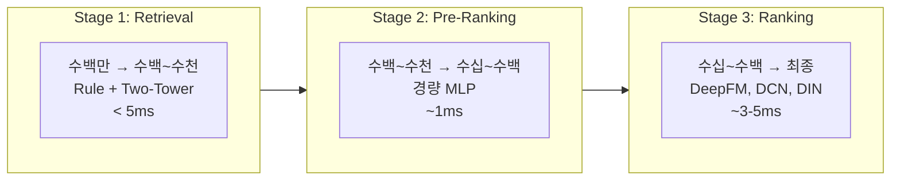
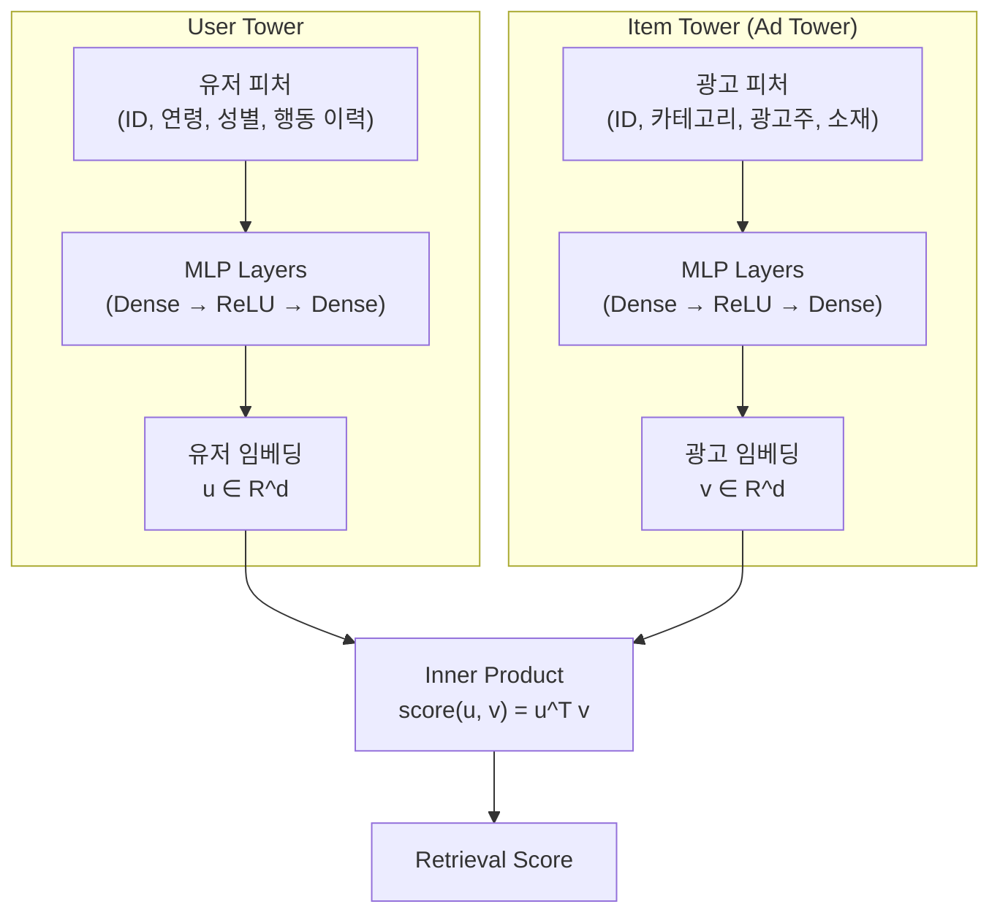
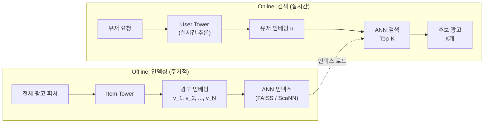

대형 서점에 들어섰다고 해봅시다. 책이 30만 권 있습니다. 그 30만 권을 다 펼쳐 읽고 한 권을 고르는 사람은 없습니다. 먼저 층과 서가로 범위를 좁힙니다. 그다음 그 서가에서 몇 권만 실제로 펼쳐 봅니다.

광고도 똑같습니다. 프로덕션 광고 시스템에는 수백만 개의 광고 후보가 있습니다. 그런데 유저에게 실제로 보여줄 수 있는 광고는 1~3개입니다. 수백만 개 모두에 DeepFM이나 DCN 같은 무거운 pCTR 모델을 돌리는 것은 물리적으로 불가능합니다.

> 한 줄 요약: 광고 100만 개를 다 점수 낼 수는 없다. 그래서 유저와 광고를 각각 벡터로 바꿔 두고, 곱셈 몇 번으로 수백 개까지 먼저 좁힌다.

**후보 생성(Retrieval)**은 이 수백만 개를 수백~수천 개로 줄이는 첫 관문입니다. 여기서 놓친 광고는 복구할 수 없습니다. 뒤에 아무리 정교한 랭킹 모델이 있어도 소용없습니다. 이 글은 Retrieval의 표준 방법론인 **Two-Tower Model**을 해부합니다. ANN 인덱스로 10ms 이내에 후보를 추리는 실무 아키텍처까지 다룹니다.

> 이 글의 자리: Retrieval은 광고 파이프라인의 첫 단계입니다. 앞뒤 단계는 다른 글에서 다룹니다.

- 파이프라인 전체 구조(Multi-Stage Ranking) → [모델 서빙 아키텍처](post.html?id=model-serving-architecture)
- 피처가 모델에 도달하는 과정 → [Feature Store](post.html?id=feature-store-serving)
- 랭킹 단계의 모델 진화 → [Deep CTR Models](post.html?id=deep-ctr-models)

---

## 1. 핵심 비교 (Executive Summary)

Retrieval 방법론은 여러 가지입니다. 그런데 프로덕션에서 실제로 쓰이는 선택지는 몇 개뿐입니다. 먼저 전체 지형을 봅니다.

| 방법 | 후보 수 처리 | 레이턴시 | 개인화 수준 | 구현 복잡도 |
|------|------------|---------|-----------|-----------|
| **Rule-based** | 수백만 → 수천 | < 1ms | 없음 (세그먼트 단위) | 매우 낮음 |
| **Inverted Index** | 수백만 → 수천 | < 1ms | 낮음 (속성 매칭) | 낮음 |
| **Two-Tower (DSSM)** | 수백만 → 수백~수천 | 1~5ms | 높음 (유저별 임베딩) | 중간 |
| **Multi-Interest** | 수백만 → 수백~수천 | 3~10ms | 매우 높음 (관심사별) | 높음 |
| **Graph-based** | 수백만 → 수백~수천 | 5~15ms | 매우 높음 (관계 기반) | 매우 높음 |

> 핵심 관찰: Rule-based와 Inverted Index는 빠르고 단순하지만 개인화에 한계가 있습니다. Two-Tower는 개인화와 레이턴시의 **최적 균형점**으로, 대부분의 프로덕션 광고 시스템에서 Retrieval의 핵심 엔진입니다.

표의 '후보 수 처리' 열을 보면 다섯 방법 모두 결국 수백~수천 개로 줄입니다. 갈리는 건 **줄이는 기준**입니다. Rule-based는 광고주가 미리 적어 둔 타겟 조건으로 줄입니다. Two-Tower는 유저와 광고를 벡터로 바꿔, 방향이 비슷한 쪽으로 줄입니다. 이 기준의 차이가 개인화 수준의 차이로 그대로 이어집니다.

레이턴시 열의 1~5ms도 눈여겨보세요. 광고 요청 하나에 허용된 시간이 보통 100ms 안쪽입니다. Retrieval이 그중 5ms를 쓰면 나머지 95ms를 뒤 단계들이 나눠 씁니다. 그래서 Retrieval의 예산은 늘 '한 자리 ms'로 잡힙니다.

표의 숫자는 실측이 아니라 실무에서 흔히 보는 대략치입니다. 절대값보다 방법 사이의 순서를 보세요.

---

## 2. 왜 Retrieval이 필요한가: Multi-Stage Ranking 복습

### 깔때기의 물리적 제약

수백만 개의 광고 후보에 DeepFM 같은 복잡한 모델을 돌린다고 해봅시다. 광고 하나당 추론이 0.1ms라고 가정합니다. 그러면 100만 개에 100초가 필요합니다. RTB의 100ms 타임아웃 안에서 이것은 불가능합니다. 그래서 깔때기 구조가 필수입니다. **단계별로 후보를 줄이면서 모델 복잡도를 올리는** 방식입니다.


```mermaid
graph LR
    subgraph Stage1["Stage 1: Retrieval"]
        R["수백만 → 수백~수천<br/>Rule + Two-Tower<br/>< 5ms"]
    end
    subgraph Stage2["Stage 2: Pre-Ranking"]
        P["수백~수천 → 수십~수백<br/>경량 MLP<br/>~1ms"]
    end
    subgraph Stage3["Stage 3: Ranking"]
        K["수십~수백 → 최종<br/>DeepFM, DCN, DIN<br/>~3-5ms"]
    end
    Stage1 --> Stage2 --> Stage3
```

### 각 단계별 비교

| | Retrieval | Pre-Ranking | Ranking |
|---|---|---|---|
| **입력 후보** | 수백만 | 수백~수천 | 수십~수백 |
| **출력 후보** | 수백~수천 | 수십~수백 | 최종 1~10개 |
| **모델** | Rule / Two-Tower / ANN | 경량 MLP, LR | DeepFM, DCN, DIN |
| **레이턴시** | < 5ms | ~1ms | ~3-5ms |
| **최적화 목표** | **Recall** (누락 방지) | Recall + 경량성 | **Precision** (정확도) |

### Retrieval의 핵심 제약: Recall이 최우선

Retrieval 단계에서 탈락한 광고는 이후 어떤 단계에서도 복구할 수 없습니다. Pre-Ranking과 Ranking이 아무리 정교해도, 후보 풀에 없는 광고는 유저에게 도달하지 못합니다. 따라서 Retrieval은 **precision보다 recall을 극대화**해야 합니다. 좋은 광고를 하나라도 놓치는 것이, 나쁜 광고를 몇 개 포함하는 것보다 훨씬 치명적입니다.

> Retrieval에서 놓친 광고는 아무리 좋은 Ranking 모델이 있어도 복구할 수 없다. 이것이 Retrieval이 전체 파이프라인 성능의 상한선(upper bound)을 결정하는 이유이다.

### 계산으로 확인 — 정밀 모델 전수는 왜 불가능한가

말로만 "불가능하다"고 하면 감이 안 옵니다. 곱셈 횟수를 직접 세어 봅니다.

정밀 랭킹 모델은 광고 하나를 채점할 때 층을 여러 개 통과합니다. 그래서 **후보 수에 정비례**해 시간이 늘어납니다. 반면 투 타워의 점수 계산은 곱셈 64번(임베딩 차원만큼)과 덧셈뿐입니다. 이 비대칭이 전부입니다.

앞에서는 광고 1건 추론을 0.1ms로 잡았습니다. 아래 코드는 실무 DeepFM에 더 가까운 0.3ms를 씁니다.

```python
# 왜 후보 전체에 정밀 모델을 못 돌리는가 — 곱셈 횟수를 직접 세어 본다.
# 표준 라이브러리만 쓴다. 숫자는 가상이지만 실측 범위에서 크게 벗어나지 않게 잡았다.

BUDGET_MS      = 100.0   # 광고 요청 하나에 허용된 전체 시간 (가상)
RANK_MS_PER_AD = 0.3     # 정밀 랭킹 모델이 광고 1건을 채점하는 시간 (가상)
USER_TOWER_MS  = 0.8     # 유저 타워(경량 MLP) 1회 추론 시간 (가상)
DIM            = 64      # 임베딩 차원 = 내적 1건에 필요한 곱셈 횟수
MULADD_PER_SEC = 5e8     # 최적화된 C 라이브러리가 1초에 처리하는 곱셈-덧셈 쌍 (가상)


def cell(s, width, right=True):
    """한글은 화면에서 두 칸을 차지한다. 그만큼 빼서 표 자리를 맞춘다."""
    gap = " " * max(0, width - len(s) - sum(1 for c in s if ord(c) > 0x2000))
    return gap + s if right else s + gap


def rank_all_ms(n_ads):
    """후보 n_ads개를 전부 정밀 랭킹 모델로 채점할 때 걸리는 시간(ms).
    후보 수에 정비례한다. 이 정비례가 문제의 핵심이다."""
    return n_ads * RANK_MS_PER_AD


def two_tower_ms(n_ads, scan_ratio=1.0):
    """투 타워로 n_ads개를 훑을 때 걸리는 시간(ms).

    scan_ratio=1.0  → 후보 전체와 내적을 다 해보는 경우 (brute force)
    scan_ratio=0.02 → ANN 인덱스가 전체의 2%만 골라 훑는 경우
    """
    muladds = n_ads * scan_ratio * DIM        # 내적 1건 = 곱셈-덧셈 DIM쌍
    dot_ms = muladds / MULADD_PER_SEC * 1000  # 초 단위를 ms로 바꾼다
    return USER_TOWER_MS + dot_ms             # 유저 타워는 후보 수와 무관하게 딱 1회


print(cell("후보 수", 12) + cell("정밀모델 전수", 16)
      + cell("투타워 전수내적", 17) + cell("투타워+ANN 2%", 16) + cell("절감 배수", 11))
for n in (10_000, 100_000, 1_000_000):
    full = rank_all_ms(n)          # 정밀 모델을 후보 전체에 돌리는 경우
    brute = two_tower_ms(n)        # 내적만 전수로 도는 경우
    ann = two_tower_ms(n, 0.02)    # ANN으로 2%만 훑는 경우
    print(f"{n:>12,}{full:>14,.0f}ms{brute:>15.1f}ms{ann:>14.1f}ms"
          f"{full / brute:>10,.0f}배")

print()
# 100ms 예산을 넘는지 하나씩 확인한다. 넘으면 그 방식은 애초에 못 쓴다.
for label, ms in (("정밀모델 전수 (10만 개)", rank_all_ms(100_000)),
                  ("투타워 전수내적 (10만 개)", two_tower_ms(100_000)),
                  ("투타워 전수내적 (100만 개)", two_tower_ms(1_000_000)),
                  ("투타워+ANN 2% (100만 개)", two_tower_ms(1_000_000, 0.02))):
    verdict = "예산 초과" if ms > BUDGET_MS else "통과"
    print(cell(label, 27, right=False)
          + f"{ms:>10,.1f}ms   예산의 {ms / BUDGET_MS:>8.1%}  → {verdict}")

# 출력:
#      후보 수   정밀모델 전수  투타워 전수내적   투타워+ANN 2%  절감 배수
#       10,000         3,000ms            2.1ms           0.8ms     1,442배
#      100,000        30,000ms           13.6ms           1.1ms     2,206배
#    1,000,000       300,000ms          128.8ms           3.4ms     2,329배
#
# 정밀모델 전수 (10만 개)      30,000.0ms   예산의 30000.0%  → 예산 초과
# 투타워 전수내적 (10만 개)        13.6ms   예산의    13.6%  → 통과
# 투타워 전수내적 (100만 개)      128.8ms   예산의   128.8%  → 예산 초과
# 투타워+ANN 2% (100만 개)          3.4ms   예산의     3.4%  → 통과
```

숫자 세 개만 기억하면 됩니다. 광고 10만 개에 정밀 모델을 다 돌리면 **30초**입니다. 100ms 예산의 300배입니다. 같은 10만 개를 투 타워 내적으로 훑으면 **13.6ms**입니다. 2,206배 빨라집니다.

그런데 후보가 100만 개로 늘면 전수 내적도 128.8ms가 되어 예산을 넘습니다. 여기서 ANN이 등장합니다. 전체의 2%만 골라 훑으면 3.4ms로 떨어집니다. 이 세 줄이 §4의 구조가 왜 그렇게 생겼는지를 전부 설명합니다.

---

## 3. Rule-Based Retrieval (Baseline)

### 타겟팅 규칙 매칭

가장 전통적인 Retrieval 방법은 광고주가 설정한 타겟 조건으로 필터링하는 것입니다. 캠페인마다 아래와 같은 타겟 조건이 붙어 있습니다.

- **연령**: 20~34세
- **성별**: 여성
- **지역**: 서울, 경기
- **관심사 카테고리**: 패션, 뷰티
- **디바이스**: iOS

요청이 들어오면 유저의 속성과 캠페인의 타겟 조건을 매칭하여, 조건에 부합하는 광고만 후보로 통과시킵니다.

### Inverted Index

실무에서는 이 매칭을 빠르게 하려고 **Inverted Index**(역색인)를 만들어 둡니다.

```
유저 속성 → 해당 속성을 타겟하는 광고 목록

gender=female   → [ad_001, ad_045, ad_112, ad_389, ...]
age=25-34       → [ad_001, ad_023, ad_045, ad_078, ...]
region=seoul    → [ad_001, ad_045, ad_200, ad_567, ...]

최종 후보 = intersection(gender, age, region)
         = [ad_001, ad_045, ...]
```

유저의 속성을 키로 인덱스를 조회하고, 교집합을 구하면 됩니다. 검색 엔진의 역색인과 동일한 원리이며, 수백만 광고에서 수천 개를 뽑는 데 1ms 이내로 충분합니다.

### 장점과 한계

| 장점 | 한계 |
|------|------|
| 매우 빠름 (< 1ms) | 타겟 조건 바깥의 잠재 고객을 발견하지 못함 |
| 구현이 단순하고 디버깅이 쉬움 | 타겟 조건이 넓으면 후보가 너무 많고, 좁으면 너무 적음 |
| 광고주 의도를 정확히 반영 | 개인화 불가 (동일 세그먼트 내 유저를 구분 못함) |
| 비즈니스 로직 준수 보장 | 새로운 유저-광고 매칭 탐색 불가 |

Rule-based Retrieval은 **필수 필터**로서의 역할은 계속하지만, 그 자체로는 개인화된 후보 생성이 불가능합니다. 이것이 Two-Tower Model이 필요한 이유입니다.

---

## 4. Two-Tower Model (DSSM)

Two-Tower Model의 출발점은 2013년 Microsoft의 DSSM입니다. DSSM은 Deep Structured Semantic Model의 줄임말입니다. 지금은 대규모 추천·광고 시스템 대부분이 Retrieval 엔진으로 이 구조를 씁니다. 핵심 아이디어는 단순합니다. **유저와 광고를 같은 벡터 공간에 올려 두고, 가까운 것을 후보로 고른다.**

### 4-1. 아키텍처


```mermaid
graph TD
    subgraph UserTower["User Tower"]
        UF["유저 피처<br/>(ID, 연령, 성별, 행동 이력)"]
        UMLP["MLP Layers<br/>(Dense → ReLU → Dense)"]
        U["유저 임베딩<br/>u ∈ R^d"]
        UF --> UMLP --> U
    end
    subgraph ItemTower["Item Tower (Ad Tower)"]
        AF["광고 피처<br/>(ID, 카테고리, 광고주, 소재)"]
        AMLP["MLP Layers<br/>(Dense → ReLU → Dense)"]
        V["광고 임베딩<br/>v ∈ R^d"]
        AF --> AMLP --> V
    end
    U --> SIM["Inner Product<br/>score(u, v) = u^T v"]
    V --> SIM
    SIM --> OUT["Retrieval Score"]
```

**User Tower**는 유저 피처를 입력받아 유저 임베딩 벡터를 출력합니다.

$$u = f_{\text{user}}(x_{\text{user}}) \in \mathbb{R}^d$$

**Item Tower**는 광고 피처를 입력받아 광고 임베딩 벡터를 출력합니다.

$$v = g_{\text{item}}(x_{\text{item}}) \in \mathbb{R}^d$$

두 벡터의 유사도가 Retrieval 점수입니다.

$$\text{score}(u, v) = u^T v$$

cosine similarity를 쓰기도 합니다.

$$\text{score}(u, v) = \frac{u^T v}{\|u\| \cdot \|v\|}$$

두 타워가 **독립적으로** 임베딩을 계산한다는 점이 핵심입니다. 유저와 광고 사이의 교차 피처(cross feature)는 사용하지 않습니다. 이 제약이 서빙 시 엄청난 효율성을 가능하게 합니다.

#### 직접 구현 — 내적과 코사인은 다른 답을 낸다

"벡터 내적으로 후보를 뽑는다"는 말은 코드로 보면 정말 짧습니다. 곱해서 더하고, 정렬해서 위에서 자르는 것뿐입니다. 차원을 4로 줄여 손으로 따라갈 수 있게 해봅니다.

여기서 한 가지가 갈립니다. 내적은 벡터의 **길이**에도 영향을 받습니다. 코사인은 길이를 나눠 버리고 **방향**만 봅니다. 같은 후보 풀에서 둘이 다른 상위 5개를 뽑습니다.

```python
import math
import random

# 투 타워의 '검색' 부분을 직접 구현해 본다.
# 유저 벡터 1개 vs 광고 벡터 20개. 차원은 눈으로 볼 수 있게 4로 줄였다 (실무는 64~128).
random.seed(42)                      # 돌릴 때마다 같은 결과가 나오게 고정
DIM = 4
N_ADS = 20

# 유저 타워가 뽑아낸 유저 임베딩 (가상). 실제로는 MLP의 마지막 층 출력이다.
user_vec = [round(random.uniform(-1, 1), 3) for _ in range(DIM)]

# 광고 타워가 미리 구워둔 광고 임베딩 20개 (가상).
# 벡터 길이가 광고마다 다르다는 점을 눈여겨보자. 실제 학습에서도 자주 등장한 광고일수록
# 벡터가 길어지는 경향이 있고, 그 길이가 내적 점수에 그대로 실린다.
ads = {}
for i in range(N_ADS):
    ads[f"ad_{i:02d}"] = [round(random.uniform(-1, 1), 3) for _ in range(DIM)]


def dot(a, b):
    """내적 = 같은 자리끼리 곱해서 전부 더한다. 투 타워의 점수 계산은 이게 전부다."""
    return sum(x * y for x, y in zip(a, b))


def norm(a):
    """벡터의 길이. 각 원소를 제곱해 더한 뒤 제곱근을 씌운다."""
    return math.sqrt(sum(x * x for x in a))


def cosine(a, b):
    """코사인 유사도 = 내적을 두 벡터의 길이로 나눈 값. 길이를 지우고 '방향'만 본다."""
    return dot(a, b) / (norm(a) * norm(b))


def top_k(score_fn, k=5):
    """광고 전부를 점수 매겨 상위 k개만 남긴다. 이게 가장 단순한 전수 검색이다."""
    scored = [(name, score_fn(user_vec, v)) for name, v in ads.items()]
    scored.sort(key=lambda pair: pair[1], reverse=True)
    return scored[:k]


print(f"유저 임베딩 u = {user_vec}  (길이 {norm(user_vec):.3f})")
print(f"광고 후보 {N_ADS}개, 차원 {DIM} → 곱셈 {N_ADS * DIM}번으로 검색이 끝난다\n")

by_dot = top_k(dot)
by_cos = top_k(cosine)

print("순위  내적 기준          코사인 기준")
for rank, (d, c) in enumerate(zip(by_dot, by_cos), start=1):
    print(f" {rank}    {d[0]}  {d[1]:+.3f}     {c[0]}  {c[1]:+.3f}")

# 두 방식이 고른 상위 5개 집합이 같은지 확인한다. 다르면 어디서 갈렸는지 들여다본다.
set_dot, set_cos = {n for n, _ in by_dot}, {n for n, _ in by_cos}
print(f"\n내적만 뽑은 광고   : {sorted(set_dot - set_cos)}")
print(f"코사인만 뽑은 광고 : {sorted(set_cos - set_dot)}")
for name in sorted(set_dot ^ set_cos):
    print(f"  {name}: 벡터 길이 {norm(ads[name]):.3f}, "
          f"내적 {dot(user_vec, ads[name]):+.3f}, 코사인 {cosine(user_vec, ads[name]):+.3f}")

# 출력:
# 유저 임베딩 u = [0.279, -0.95, -0.45, -0.554]  (길이 1.221)
# 광고 후보 20개, 차원 4 → 곱셈 80번으로 검색이 끝난다
#
# 순위  내적 기준          코사인 기준
#  1    ad_09  +1.455     ad_09  +0.985
#  2    ad_05  +1.379     ad_11  +0.851
#  3    ad_01  +1.097     ad_01  +0.812
#  4    ad_10  +0.878     ad_05  +0.752
#  5    ad_18  +0.802     ad_18  +0.607
#
# 내적만 뽑은 광고   : ['ad_10']
# 코사인만 뽑은 광고 : ['ad_11']
#   ad_10: 벡터 길이 1.351, 내적 +0.878, 코사인 +0.533
#   ad_11: 벡터 길이 0.743, 내적 +0.771, 코사인 +0.851
```

`ad_10`과 `ad_11`을 비교해 보세요. `ad_10`은 벡터 길이가 1.351로 깁니다. 방향은 유저와 별로 안 맞습니다(코사인 0.533). 그런데 길이 덕에 내적이 +0.878까지 올라가 상위 5개 안에 듭니다.

`ad_11`은 반대입니다. 길이가 0.743으로 짧습니다. 대신 방향이 유저와 잘 맞습니다(코사인 0.851). 내적으로 재면 +0.771로 밀려 6위입니다.

실무에서 이 차이는 취향 문제가 아닙니다. 내적을 쓰면 **자주 학습된 인기 광고가 유리**해집니다. 벡터가 길어지기 때문입니다. 그 성향을 그대로 두고 싶으면 내적, 지우고 싶으면 코사인입니다. ANN 인덱스가 어느 쪽 거리를 지원하는지도 함께 봐야 합니다.

### 4-2. 학습

#### Positive Pair

학습 데이터의 positive pair는 (유저, 클릭한 광고)입니다. 유저가 광고를 클릭했다면, 해당 유저 임베딩과 광고 임베딩의 내적이 높아야 합니다.

#### Negative Pair: 성능의 80%를 결정하는 선택

Two-Tower 학습에서 **negative sampling 전략이 모델 성능의 대부분을 결정**합니다. 질문은 하나입니다. 어떤 광고를 "유저가 관심 없는 광고"로 규정할 것인가?

| 전략 | 방법 | 장점 | 단점 |
|------|------|------|------|
| **Random Negative** | 전체 광고 풀에서 랜덤 샘플링 | 구현 단순, 계산 효율적 | 대부분 too easy, 학습 신호 약함 |
| **In-batch Negative** | 같은 배치 내 다른 유저의 positive를 negative로 사용 | 추가 계산 없이 효율적, 적절한 난이도 | 인기 광고에 대한 sampling bias |
| **Hard Negative** | 노출되었으나 클릭하지 않은 광고 | 가장 informative한 학습 신호 | false negative 위험, 학습 불안정 가능 |

**In-batch Negative**가 실무에서 가장 널리 쓰입니다. 배치 크기가 $B$일 때, 각 유저의 positive 1개에 대해 나머지 $B-1$개가 자동으로 negative가 됩니다. 추가 샘플링 비용 없이 풍부한 negative를 확보할 수 있습니다.

다만, In-batch Negative는 인기 광고가 negative로 더 자주 등장하는 **sampling bias**가 발생합니다. 인기 광고는 많은 유저의 positive에 포함되므로, 다른 유저의 배치에서 negative로 과대 표집됩니다. 이를 보정하지 않으면 모델이 인기 광고의 점수를 과소평가하게 됩니다.

#### 직접 구현 — in-batch negative가 인기 광고를 깎는다

"과대 표집"이라는 말이 추상적이니 숫자로 세어 봅니다. 배치 크기가 8이라고 합시다. 한 행의 negative는 나머지 7개입니다. 클릭 로그에서 배치를 뽑으면, 클릭이 많은 광고가 배치에 더 자주 앉습니다. 그러면 그 광고는 남의 negative 자리에도 더 자주 앉습니다.

보정을 빼먹으면 학습이 수렴한 뒤의 점수가 진짜 점수와 어긋납니다. 어긋나는 양은 $-\log q$ 입니다. 여기서 $q$는 그 광고가 배치에 뽑힐 확률입니다. $q$가 큰 인기 광고는 더해지는 값이 작습니다. $q$가 작은 롱테일은 크게 부풀려집니다. 그래서 **인기 광고가 상대적으로 깎입니다**.

```python
import math
import random

# in-batch negative의 함정을 숫자로 확인한다.
# 배치 안의 '남의 정답'을 negative로 쓰면, 인기 광고가 negative 자리에 훨씬 자주 앉는다.
random.seed(42)
BATCH = 8            # 배치 크기. 한 행의 negative는 나머지 BATCH-1개다.
N_BATCH = 2_000      # 학습 배치 수

# 가상 데이터: 광고 8개의 클릭 점유율과, 이 유저에게 매긴 '진짜 적합도' 점수.
# 진짜 적합도는 편향이 하나도 없다면 모델이 배웠어야 할 값이다.
share = {"ad_A": 0.35, "ad_B": 0.20, "ad_C": 0.14, "ad_D": 0.10,
         "ad_E": 0.08, "ad_F": 0.06, "ad_G": 0.04, "ad_H": 0.03}
true_score = {"ad_A": 3.0, "ad_B": 2.2, "ad_C": 1.6, "ad_D": 1.5,
              "ad_E": 1.4, "ad_F": 1.3, "ad_G": 1.2, "ad_H": 2.4}

names = list(share)
weights = [share[n] for n in names]

# 클릭 로그를 점유율대로 뽑아 배치를 만든다. 배치 안에 몇 번 앉았는지만 센다.
seen = {n: 0 for n in names}
for _ in range(N_BATCH):
    for pick in random.choices(names, weights=weights, k=BATCH):
        seen[pick] += 1

total_rows = N_BATCH * BATCH
# 한 배치에 한 번 앉으면, 그 배치의 다른 BATCH-1개 행에 대해 negative로 쓰인다.
neg_count = {n: seen[n] * (BATCH - 1) for n in names}
# 표집 확률 q는 관측된 등장 비율로 추정한다. 실무에서도 이렇게 스트리밍 카운트로 센다.
q_hat = {n: seen[n] / total_rows for n in names}

# 보정을 안 하면, 학습이 수렴한 모델의 점수는 진짜 점수에서 log q 만큼 밀린다.
#   보정 전 점수 = 진짜 점수 - log(q)
# q가 큰 인기 광고는 빼주는 값이 작고, q가 작은 롱테일은 크게 부풀려진다. 결과는 순위 왜곡.
biased = {n: true_score[n] - math.log(q_hat[n]) for n in names}
# log-Q 보정은 학습 loss의 logit에 -log(q)를 미리 더해 이 밀림을 상쇄한다.
#   보정 후 점수 = 진짜 점수
fixed = dict(true_score)


def rank_of(scores):
    """점수 높은 순으로 1위부터 등수를 매긴다."""
    order = sorted(scores, key=lambda n: scores[n], reverse=True)
    return {n: i + 1 for i, n in enumerate(order)}


r_biased, r_fixed = rank_of(biased), rank_of(fixed)

print(f"배치 {N_BATCH}개 × 크기 {BATCH} = 학습 행 {total_rows:,}개\n")
print("광고   점유율 negative등장 진짜점수 보정전점수(순위) 보정후점수(순위)")
for n in names:
    print(f"{n}   {q_hat[n]:>6.1%} {neg_count[n]:>12,}  "
          f"{true_score[n]:>7.2f}   {biased[n]:>8.2f} ({r_biased[n]}위)   "
          f"{fixed[n]:>8.2f} ({r_fixed[n]}위)")

top3_biased = sorted(biased, key=lambda n: biased[n], reverse=True)[:3]
top3_fixed = sorted(fixed, key=lambda n: fixed[n], reverse=True)[:3]
print(f"\n보정 전 Top-3 : {top3_biased}")
print(f"보정 후 Top-3 : {top3_fixed}")
print(f"겹치는 광고   : {sorted(set(top3_biased) & set(top3_fixed))}")

gap = neg_count["ad_A"] / neg_count["ad_H"]
print(f"\nad_A는 ad_H보다 negative로 {gap:.1f}배 자주 등장 → "
      f"보정 전 순위 {r_fixed['ad_A']}위에서 {r_biased['ad_A']}위로 밀렸다")

# 출력:
# 배치 2000개 × 크기 8 = 학습 행 16,000개
#
# 광고   점유율 negative등장 진짜점수 보정전점수(순위) 보정후점수(순위)
# ad_A    35.0%       39,207     3.00       4.05 (4위)       3.00 (1위)
# ad_B    19.6%       21,952     2.20       3.83 (6위)       2.20 (3위)
# ad_C    14.3%       15,981     1.60       3.55 (8위)       1.60 (4위)
# ad_D    10.1%       11,354     1.50       3.79 (7위)       1.50 (5위)
# ad_E     8.3%        9,338     1.40       3.88 (5위)       1.40 (6위)
# ad_F     5.5%        6,209     1.30       4.19 (3위)       1.30 (7위)
# ad_G     4.0%        4,529     1.20       4.41 (2위)       1.20 (8위)
# ad_H     3.1%        3,430     2.40       5.89 (1위)       2.40 (2위)
#
# 보정 전 Top-3 : ['ad_H', 'ad_G', 'ad_F']
# 보정 후 Top-3 : ['ad_A', 'ad_H', 'ad_B']
# 겹치는 광고   : ['ad_H']
#
# ad_A는 ad_H보다 negative로 11.4배 자주 등장 → 보정 전 순위 1위에서 4위로 밀렸다
```

가장 인기 있는 `ad_A`는 negative로 39,207번 등장했습니다. 롱테일 `ad_H`는 3,430번입니다. 11.4배 차이입니다.

그 결과가 순위에 그대로 찍힙니다. `ad_A`는 진짜 적합도 1위인데 보정 전에는 4위로 밀립니다. 반대로 적합도 꼴찌인 `ad_G`는 2위까지 올라옵니다. 후보를 3개만 뽑는다면 **진짜 1위 광고가 아예 빠집니다**. 보정 전 Top-3와 보정 후 Top-3에서 겹치는 건 `ad_H` 하나뿐입니다.

이 편향이 얼마나 크게 나타나는지는 진짜 점수들이 얼마나 벌어져 있는지에 달려 있습니다. 점수 차가 촘촘하면 위 예시처럼 순위가 크게 흔들립니다. 노출 편향과 다운샘플링 보정까지 함께 본 전체 그림은 다른 글에 있습니다. 이어서 읽으려면 [Negative Sampling](post.html?id=negative-sampling-bias)으로 가세요.

#### Loss Function

가장 일반적인 loss는 **Softmax Cross-Entropy**입니다. 배치 내 positive pair $(u_i, v_i^+)$에 대해 아래 식을 최소화합니다.

$$\mathcal{L} = -\sum_{i=1}^{B} \log \frac{\exp(u_i^T v_i^+ / \tau)}{\sum_{j=1}^{B} \exp(u_i^T v_j / \tau)}$$

여기서 $\tau$는 temperature parameter로, 유사도 분포의 sharpness를 조절합니다. $\tau$가 작을수록 hard negative에 더 집중합니다.

**Sampling Bias Correction** (Yi et al., 2019)은 각 아이템의 sampling 확률 $p_j$를 보정합니다. 위 코드에서 본 $\log q$ 보정이 바로 이 식입니다.

$$\mathcal{L} = -\sum_{i=1}^{B} \log \frac{\exp(u_i^T v_i^+ / \tau - \log p_{i}^+)}{\sum_{j=1}^{B} \exp(u_i^T v_j / \tau - \log p_j)}$$

이 보정이 없으면 인기 광고에 대한 systematic한 과소평가가 발생합니다.

### 4-3. 서빙: ANN (Approximate Nearest Neighbor)

Two-Tower의 진짜 강점은 서빙 효율성에 있습니다. 두 타워가 독립적이므로, 광고 임베딩을 사전 계산하여 인덱스에 저장해 둘 수 있습니다.


```mermaid
graph LR
    subgraph Offline["Offline: 인덱싱 (주기적)"]
        ITEMS["전체 광고 피처"]
        IT["Item Tower"]
        EMB["광고 임베딩<br/>v_1, v_2, ..., v_N"]
        ANN_IDX["ANN 인덱스<br/>(FAISS / ScaNN)"]
        ITEMS --> IT --> EMB --> ANN_IDX
    end
    subgraph Online["Online: 검색 (실시간)"]
        REQ["유저 요청"]
        UT["User Tower<br/>(실시간 추론)"]
        U_EMB["유저 임베딩 u"]
        SEARCH["ANN 검색<br/>Top-K"]
        CAND["후보 광고<br/>K개"]
        REQ --> UT --> U_EMB --> SEARCH --> CAND
    end
    ANN_IDX -.->|"인덱스 로드"| SEARCH
```

**Offline 단계:**

1. Item Tower로 모든 광고의 임베딩 $v_i$를 사전 계산
2. 전체 임베딩을 ANN 인덱스에 저장 (수백만 벡터)
3. 인덱스를 주기적으로 갱신 (hourly 또는 daily)

**Online 단계:**

1. 유저 요청이 들어오면 User Tower로 유저 임베딩 $u$를 실시간 계산
2. ANN 인덱스에서 $u$와 가장 유사한 top-K 광고를 검색
3. 검색 결과를 다음 단계(Pre-Ranking)로 전달

핵심은 **서빙 시점에 Item Tower를 실행하지 않는다**는 것입니다. 수백만 광고에 대해 모델 추론을 하는 대신, 사전 계산된 벡터에서 nearest neighbor 검색만 수행합니다. 이것이 수백만 후보에서 5ms 이내에 top-K를 추출할 수 있는 이유입니다.

### 4-4. ANN 인덱스 비교

ANN(Approximate Nearest Neighbor)은 정확한 nearest neighbor 대신 근사 결과를 빠르게 반환합니다. 정확도(recall)와 속도를 손잡이로 조절할 수 있습니다.

| 인덱스 | 알고리즘 | 검색 시간 (1M 벡터, d=128) | Recall@100 | 빌드 시간 | 메모리 |
|--------|---------|--------------------------|-----------|----------|-------|
| **FAISS-IVF** | Inverted File Index + PQ | ~0.5ms | 90~95% | 수 분 | 낮음 (PQ 압축) |
| **FAISS-HNSW** | Hierarchical NSW 그래프 | ~0.3ms | 95~99% | 수십 분 | 높음 (그래프 저장) |
| **ScaNN** | Anisotropic Vector Quantization | ~0.2ms | 95~98% | 수 분 | 중간 |
| **Annoy** | Random Projection Trees | ~1ms | 85~92% | 수 분 | 중간 |

| 선택 기준 | 권장 인덱스 |
|----------|-----------|
| Recall 최우선 | FAISS-HNSW |
| 레이턴시 최우선 | ScaNN |
| 메모리 제약 | FAISS-IVF + PQ |
| 빠른 프로토타이핑 | Annoy |

위 두 표의 시간과 recall도 대략치입니다. 하드웨어와 파라미터 설정에 따라 크게 달라집니다.

**FAISS-HNSW**는 recall이 가장 높지만 메모리를 많이 사용합니다. **ScaNN**은 Google이 개발한 라이브러리로, anisotropic vector quantization을 통해 recall과 속도 모두에서 우수한 성능을 보입니다. 실무에서는 FAISS-IVF와 HNSW를 조합하거나, ScaNN을 사용하는 경우가 가장 많습니다.

:::deep 더 깊이 — '근사'가 정확한 탐색과 정확히 뭐가 다른가
§2의 계산에서 100만 개 전수 내적은 128.8ms였다. 예산을 넘는다. ANN은 여기서 **일부만 보고 답한다**. 전체의 2%만 훑으면 3.4ms다. 대신 진짜 1위를 놓칠 확률이 생긴다. 표의 Recall@100 90~99%가 바로 "놓치는 비율"이다.

훑을 범위를 줄이는 방법이 두 갈래다. **IVF**(Inverted File)는 벡터를 미리 수천 개 군집으로 나눠 둔다. 검색할 때 유저 벡터와 가까운 군집 몇 개만 열어 본다. 열어 보는 군집 수(`nprobe`)가 손잡이다. 1로 두면 빠르고 부정확하고, 32로 올리면 느리고 정확하다. 여기에 PQ(Product Quantization)를 붙이면 벡터를 짧은 코드로 압축해 메모리를 줄인다. 압축한 만큼 거리 계산이 부정확해진다.

**HNSW**는 군집 대신 그래프를 만든다. 벡터마다 "가까운 이웃 몇 개"로 링크를 걸어 두고, 층을 쌓는다. 위층은 링크가 드문드문해 멀리 건너뛴다. 아래층은 촘촘해 세밀하게 좁힌다. 검색은 위층에서 대충 방향을 잡고 아래층으로 내려오며 다듬는다. 손잡이는 `efSearch`(탐색 중 후보 큐 크기)다. 그래프 링크를 전부 저장해야 하니 메모리가 IVF보다 많이 든다.

정확한 탐색(brute force)은 후보 수에 정비례한다. ANN은 대략 로그에 가깝게 늘어난다. 광고가 10배 늘어도 검색 시간이 10배가 되지 않는다는 뜻이다. Retrieval이 recall 최우선인 단계라, 여기서 몇 %를 잃는 게 아깝다. 그래서 실무에서는 손잡이를 recall 쪽으로 붙이고, 부족하면 Rule-based 후보를 합집합으로 얹어 메꾼다.
:::

---

## 5. Two-Tower의 한계와 개선

### 5-1. 표현력 한계: User-Item Interaction 불가

Two-Tower의 가장 근본적인 한계는 **유저와 광고의 교차 피처(cross feature)를 포착하지 못한다**는 것입니다.

두 타워가 독립적으로 임베딩을 계산합니다. 그래서 "이 유저의 이 속성이 이 광고의 이 속성과 만났을 때" 같은 세밀한 interaction을 모델링할 수 없습니다.

$$\text{Two-Tower: } \text{score} = f(x_{\text{user}})^T g(x_{\text{item}})$$

$$\text{Ranking Model: } \text{score} = h(x_{\text{user}}, x_{\text{item}}, x_{\text{user} \times \text{item}})$$

랭킹 모델은 다릅니다. 유저-광고 교차 피처를 직접 입력받습니다. cross network이나 FM layer에서 interaction을 명시적으로 학습합니다. 따라서 랭킹 모델이 항상 더 정확합니다. 그 구조는 [Deep CTR Models](post.html?id=deep-ctr-models)에서 다룹니다.

이것이 **"Retrieval은 recall, Ranking은 precision"**이라는 역할 분담의 근본적인 이유입니다. Retrieval은 정확도를 다소 희생하더라도 빠르게 넓은 후보를 확보하고, Ranking이 그 안에서 정밀하게 순위를 매기는 구조입니다.

### 5-2. Multi-Interest Model

#### 문제: 유저의 관심사는 하나가 아니다

유저 A가 패션, 전자제품, 여행에 모두 관심이 있다고 해봅시다. 단일 벡터 $u$ 하나로는 이 세 관심사를 동시에 표현하기 어렵습니다. 벡터가 세 관심사의 평균 방향을 가리키면, 어떤 관심사에도 정확히 매칭되지 않습니다.

$$u_{\text{평균}} = \frac{1}{3}(u_{\text{패션}} + u_{\text{전자}} + u_{\text{여행}})$$

이 평균 벡터는 패션 광고와도, 전자제품 광고와도, 여행 광고와도 최적이 아닌 중간 지점에 위치합니다.

#### 해법: K개의 관심사 벡터

**MIND**(Multi-Interest Network with Dynamic Routing, Alibaba, 2019)는 유저를 단일 벡터가 아닌 $K$개의 관심사 벡터로 표현합니다:

$$u_1, u_2, \ldots, u_K = \text{CapsuleRouting}(\text{유저 행동 시퀀스})$$

각 관심사 벡터 $u_k$는 유저의 특정 관심사 클러스터를 대표합니다. Capsule Network의 dynamic routing을 사용하여 행동 시퀀스에서 자동으로 관심사를 분리합니다.

**서빙 시**에는 각 관심사 벡터 $u_k$로 ANN 검색을 따로 돌립니다. 그 결과의 합집합을 후보로 씁니다.

$$\text{후보} = \bigcup_{k=1}^{K} \text{TopK}(u_k, \text{ANN Index})$$

$K$가 3~5이면 ANN 검색을 3~5회 해야 합니다. 그만큼 레이턴시가 늘어납니다. 대신 여러 관심사를 함께 커버해 recall이 크게 오릅니다.

### 5-3. User-side Real-time Update

#### 문제: 오프라인 유저 임베딩은 실시간 행동을 반영하지 못한다

유저 임베딩을 오프라인에서 배치로 계산하면, 유저가 방금 전 검색한 "제주 호텔"이 임베딩에 반영되지 않습니다. 다음 배치 업데이트(hourly 또는 daily)까지 유저의 최신 관심사가 무시됩니다.

#### 해법: 비대칭 아키텍처

실무에서의 해법은 **User Tower를 온라인에서 실시간 추론**하는 것입니다. 두 타워의 갱신 주기를 다르게 잡습니다.

- **User Tower**: 경량 MLP로 설계하여 서빙 시점에 실시간 추론. 유저의 최근 행동(최근 클릭한 광고, 최근 검색어)을 피처로 포함
- **Item Tower**: 오프라인에서 배치로 임베딩을 계산하고 ANN 인덱스에 저장. 광고 피처는 자주 바뀌지 않으므로 주기적 갱신으로 충분

이 **비대칭 아키텍처**에서는 User Tower의 추론 레이턴시가 전체 Retrieval 레이턴시에 직접 영향을 줍니다. 따라서 User Tower는 가능한 한 경량으로 설계해야 합니다. 일반적으로 2~3 layer MLP, 임베딩 차원 64~128이면 1ms 이내 추론이 가능합니다.

---

## 6. 실무 설계 가이드

Two-Tower Retrieval 시스템을 만들 때 내려야 하는 핵심 결정들입니다. 아래 값은 실무에서 흔히 쓰이는 출발점입니다.

| 결정 사항 | 선택지 | 권장 |
|----------|--------|------|
| **임베딩 차원** | 64 / 128 / 256 | 128이 recall-레이턴시 균형점. 광고 수 1,000만 이하면 64도 충분 |
| **업데이트 주기** | Real-time / Hourly / Daily | User Tower: 실시간 추론. Item Index: hourly (새 캠페인 반영) |
| **Negative Sampling** | Random / In-batch / Hard | In-batch + Sampling Bias Correction이 표준. Hard negative를 10~20% 혼합 |
| **ANN 인덱스** | FAISS-IVF / HNSW / ScaNN | 1,000만 이하: HNSW (recall 최우선). 1억 이상: IVF+PQ (메모리 제약) |
| **Retrieval Top-K** | 100 / 500 / 1,000 / 5,000 | 500~1,000이 일반적. Recall@K와 다음 단계 처리량의 균형 |
| **Temperature $\tau$** | 0.05 / 0.1 / 0.2 | 0.05~0.1. 너무 작으면 학습 불안정, 너무 크면 학습 신호 약화 |
| **Serving Infra** | CPU / GPU | User Tower: CPU로 충분 (경량 MLP). ANN 검색: CPU (FAISS) |

### Rule-based + Two-Tower 하이브리드

실무에서는 Rule-based Retrieval과 Two-Tower를 **함께** 씁니다. 순서는 아래와 같습니다.

1. **Rule-based 필터**: 예산 소진, 타겟 불일치, frequency cap 등 비즈니스 로직으로 명백한 비후보 제거
2. **Two-Tower Retrieval**: 필터를 통과한 후보 풀(또는 전체 풀)에서 개인화된 top-K 추출
3. **합집합**: 두 결과의 합집합을 Pre-Ranking에 전달

Rule-based는 비즈니스 제약 준수를 보장하고, Two-Tower는 개인화된 탐색을 담당합니다. 두 방법은 대체 관계가 아니라 보완 관계입니다.

---

## 7. Retrieval 평가 지표

### Recall@K: 가장 중요한 지표

Retrieval의 핵심 지표는 **Recall@K**입니다. Top-K 후보에 유저가 실제로 클릭한 광고가 들어 있는 비율입니다.

$$\text{Recall@K} = \frac{|\{\text{클릭 광고}\} \cap \{\text{Top-K 후보}\}|}{|\{\text{클릭 광고}\}|}$$

예를 들어 유저가 클릭한 광고가 10개라고 합시다. Top-500 후보에 그중 9개가 들어 있다면 Recall@500은 90%입니다.

### 지표 비교

| 지표 | 정의 | Retrieval 적합성 |
|------|------|----------------|
| **Recall@K** | Top-K에 positive가 포함된 비율 | 가장 중요. Retrieval의 핵심 목표 |
| **Hit Rate@K** | Top-K에 positive가 1개 이상 포함된 쿼리의 비율 | Recall@K와 유사하나 binary |
| **NDCG@K** | Top-K 내 순위까지 고려한 지표 | Retrieval보다 **Ranking 평가**에 적합 |
| **MRR** | 첫 positive의 역순위 평균 | Retrieval보다 **Ranking 평가**에 적합 |

Retrieval 단계에서는 **순위보다 포함 여부**가 중요합니다. Top-500에서 1위든 500위든, 후보에 포함되기만 하면 Ranking 단계에서 정확한 순위를 매길 수 있습니다.

### 오프라인 평가의 한계: Serving Bias

오프라인 Recall@K 평가에는 근본적인 한계가 있습니다. 학습 데이터의 클릭은 **기존 시스템이 노출한 광고에서만** 발생했습니다. 기존 시스템이 노출하지 않은 광고 중에도 유저가 클릭했을 광고가 존재하지만, 이를 평가할 방법이 없습니다.

따라서 오프라인 Recall@K가 높다고 해서 반드시 좋은 Retrieval은 아닙니다. 최종적으로는 **온라인 A/B 테스트**에서 CTR, 전환율, 매출 등 비즈니스 지표로 검증해야 합니다.

---

## 8. 담장 안: 유저 벡터를 미리 구워둘 수 있다 [무대: 닫힌 생태계]

**로그인 ID가 어제도 오늘도 같으니, 유저 임베딩까지 미리 계산해 캐시에 얹어 둘 수 있다. 요청 때는 꺼내 쓰기만 한다.**

네이버·카카오처럼 담장 안에서 광고를 파는 회사는 유저를 로그인 ID로 알아봅니다. 그 ID는 어제도 오늘도 같습니다. 이 안정성이 §5-3에서 본 비대칭 구조를 바꿉니다. 광고 벡터만 미리 굽는 게 아니라, **유저 벡터도 미리 구워** 둘 수 있습니다.

효과는 §2의 계산으로 바로 읽힙니다. 유저 타워 추론에 잡아 뒀던 0.8ms가 사라집니다. 대신 캐시 조회 한 번이 들어갑니다. 10만 후보를 훑는 13.6ms 중 유저 타워가 0.8ms였으니, 예산이 조금 더 넉넉해집니다. 이 벡터를 어디에 저장하고 어떻게 꺼내오는지는 따로 볼 거리입니다. [Feature Store](post.html?id=feature-store-serving)에서 다룹니다.

다만 미리 구운 벡터는 **방금 전 행동을 모릅니다**. 유저가 5분 전에 검색한 "제주 호텔"이 어제 계산한 벡터에 들어 있을 수 없습니다. 그래서 실무에서는 반을 나눕니다. 장기 취향처럼 잘 안 바뀌는 부분은 미리 굽습니다. 최근 클릭 몇 개처럼 자주 바뀌는 부분만 요청 때 얹습니다. 이렇게 하면 유저 타워를 통째로 실시간으로 돌리지 않고도 최신 신호를 반영할 수 있습니다.

광고 쪽도 사정이 좋습니다. 광고 인덱스가 전부 자기 것이니, 새 캠페인이 언제 들어왔는지 정확히 압니다. 인덱스를 hourly로 다시 굽는 일정도 스스로 정합니다. 대신 §4-2에서 본 인기 광고 편향이 여기서 특히 크게 보입니다. 담장 안 트래픽은 소수의 대형 광고주에 쏠려 있어서, `ad_A`의 39,207번 같은 쏠림이 실제로 일어납니다. log-Q 보정을 빼먹으면 그 대형 광고주의 점수가 계통적으로 깎입니다.

---

## 9. 열린 RTB: 쿠키가 매번 달라 유저 타워를 실시간으로 돌린다 [무대: 열린 RTB]

**미리 구운 유저 벡터를 찾을 키가 없다. 요청마다 유저 타워를 돌려야 하고, 그 시간이 매 입찰 예산에 그대로 실린다.**

열린 RTB에서 광고를 사는 쪽(DSP)은 남의 지면에서 남의 쿠키를 봅니다. 그 쿠키는 브라우저마다 다르고 수명도 짧습니다. 어제 구워 둔 유저 벡터를 찾아올 **키 자체가 없는 경우가 많습니다**. 그래서 §8과 달리 유저 타워를 요청마다 실시간으로 돌립니다. §2에서 잡아 둔 0.8ms가 매번 예산에 실립니다.

입찰 요청 하나는 노출 한 자리에 대한 것입니다. 그래서 뽑아야 하는 후보 수 자체가 작습니다. 담장 안이 한 화면에 여러 광고를 줄 세우려 top-500을 뽑는다면, DSP는 자기 캠페인 수만 개에서 top-수십을 뽑습니다. 후보 풀이 작으니 §2의 전수 내적으로도 충분한 경우가 흔합니다. ANN 인덱스를 얹는 것보다 캠페인 풀을 잘 관리하는 편이 이득일 수 있습니다.

더 성가신 문제는 **콜드 유저**입니다. 처음 보는 쿠키는 행동 이력이 0입니다. 유저 타워에 넣을 입력이 거의 비어 있습니다. 그래서 지면·시간·디바이스 같은 컨텍스트 피처가 입력의 큰 비중을 차지합니다. 이름은 유저 타워인데 실제로는 컨텍스트 타워에 가까워집니다.

학습 데이터도 깨끗하지 않습니다. 경매에서 지면 그 노출의 클릭 여부를 못 봅니다. 그러니 학습 데이터가 자기가 이긴 노출로 편향됩니다. §4-2의 인기 광고 편향에 이 편향이 겹칩니다. 이 문제는 [Bid Shading & 검열된 데이터](post.html?id=bid-shading-censored)에서 다룹니다. 요청이 들어와 응답이 나가기까지의 전체 흐름은 [광고 서빙 흐름](post.html?id=ad-serving-flow)에 있습니다.

| 결정 | 닫힌 생태계 | 열린 RTB |
|---|---|---|
| **유저 벡터** | 미리 구워 캐시 (로그인 ID가 안정적) | 요청마다 실시간 추론 (쿠키가 매번 다름) |
| **유저 타워 비용** | 캐시 조회로 대체 가능 | 0.8ms가 매 요청 예산에 실림 |
| **후보 풀 크기** | 수백만 (자기 광고 전체) | 수만 (내 캠페인만) |
| **Top-K** | 수백~수천 (한 화면에 여러 자리) | 수십 (노출 한 자리) |
| **ANN 필요성** | 거의 필수 | 전수 내적으로 충분한 경우 많음 |
| **주된 편향** | 인기 광고 쏠림 (log-Q 보정) | 콜드 유저 + 패찰 데이터 소실 |

(위 표는 가상 데이터가 아니라 두 무대의 설계 갈림을 정리한 것입니다.)

---

## 10. 헷갈리기 쉬운 점

- **투 타워는 랭킹 모델의 축소판이 아닙니다.** 목표가 다릅니다. 투 타워는 놓치지 않는 것(recall)을, 랭킹 모델은 정확히 줄 세우는 것(precision)을 노립니다. 그래서 투 타워 점수를 그대로 입찰가에 쓰면 안 됩니다.
- **내적과 코사인은 같은 답을 주지 않습니다.** §4-1 코드에서 상위 5개가 갈렸습니다. 내적은 벡터 길이를 점수에 반영하고, 코사인은 지웁니다. 인기 쏠림을 그대로 둘지 말지의 선택입니다.
- **유사 유저 찾기(lookalike)와 뼈대는 같지만 방향이 반대입니다.** 투 타워는 유저 벡터로 광고를 찾습니다. [Lookalike 모델링](post.html?id=lookalike-modeling)은 시드 유저 벡터로 닮은 **유저**를 찾습니다. 임베딩 유사도를 쓴다는 점만 같습니다.
- **ANN의 '근사'는 버그가 아닙니다.** Recall@100이 95%면 100개 중 5개를 놓친다는 뜻입니다. 이 손실을 감수하는 대신 100배 빠릅니다. 놓친 만큼은 Rule-based 후보를 합집합으로 얹어 메꿉니다.
- **오프라인 Recall@K가 오르는 게 항상 좋은 건 아닙니다.** 기존 시스템이 보여준 광고 안에서만 재는 지표입니다. §7의 serving bias 그대로입니다. 최종 판단은 온라인 A/B입니다.

---

## 마무리

1. **Retrieval은 전체 파이프라인의 상한선** -- 수백만 후보에서 수백~수천 개를 추리는 첫 관문이며, 여기서 놓친 광고는 복구할 수 없습니다. Recall 극대화가 최우선 목표입니다.

2. **Two-Tower Model이 현재 표준** -- 유저와 광고를 독립적으로 임베딩하고, ANN 인덱스로 5ms 이내에 검색합니다. 독립 계산이라는 제약이 오히려 서빙 효율성을 가능하게 합니다.

3. **Negative Sampling이 성능을 결정** -- In-batch Negative + Sampling Bias Correction이 실무 표준입니다. Hard Negative를 적절히 혼합하면 recall이 추가로 향상됩니다.

4. **ANN 인덱스 선택은 규모에 따라** -- 1,000만 이하는 HNSW로 recall 극대화, 1억 이상은 IVF+PQ로 메모리와 속도의 균형을 잡으세요.

5. **Rule-based와 Two-Tower는 보완 관계** -- Rule-based는 비즈니스 제약 준수, Two-Tower는 개인화 탐색을 담당합니다. 실무에서는 항상 함께 사용합니다.

> Retrieval은 파이프라인의 첫 단계입니다. 뒤따르는 Ranking 단계에서 DeepFM·DCN·DIN이 정밀한 스코어링을 맡습니다. Retrieval이 쓰는 피처는 Feature Store가 공급합니다.

---

## 더 깊이 보기

- 파이프라인 전체(Multi-Stage Ranking)와 서빙 인프라 → [모델 서빙 아키텍처](post.html?id=model-serving-architecture)
- 뒤따르는 랭킹 모델의 구조(DeepFM·DCN·DIN) → [Deep CTR Models](post.html?id=deep-ctr-models)
- 임베딩을 어디에 저장하고 어떻게 꺼내오나 → [Feature Store](post.html?id=feature-store-serving)
- in-batch negative가 만드는 편향의 전체 그림 → [Negative Sampling & Bias](post.html?id=negative-sampling-bias)
- 같은 임베딩 유사도로 '유저'를 찾는 쪽 → [Lookalike 모델링](post.html?id=lookalike-modeling)
- 요청이 들어와 응답이 나가기까지 → [광고 서빙 흐름](post.html?id=ad-serving-flow)
- 패찰하면 데이터가 사라지는 문제 → [Bid Shading & 검열된 데이터](post.html?id=bid-shading-censored)
- 광고 ML 전체 지도에서 이 글의 위치 → [ML 엔지니어 트랙](ml-track.html)

---

## 참고문헌

- Huang, P.-S., He, X., Gao, J., Deng, L., Acero, A., & Heck, L. (2013). Learning Deep Structured Semantic Models for Web Search using Clickthrough Data. *CIKM*.
- Yi, X., Yang, J., Hong, L., Cheng, D. Z., Heldt, L., Kumthekar, A., ... & Chi, E. (2019). Sampling-Bias-Corrected Neural Modeling for Large Corpus Item Recommendations. *RecSys*.
- Li, C., Liu, Z., Wu, M., Xu, Y., Zhao, H., Huang, P., ... & Lee, D. (2019). Multi-Interest Network with Dynamic Routing for Recommendation at Tmall. *CIKM*.
- Guo, R., Sun, P., Lindgren, E., Geng, Q., Simcha, D., Chern, F., & Kumar, S. (2020). Accelerating Large-Scale Inference with Anisotropic Vector Quantization. *ICML*.