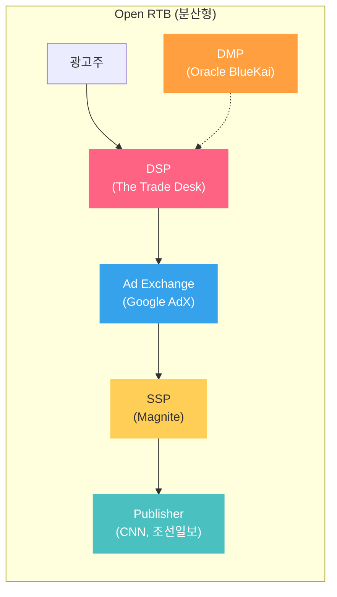
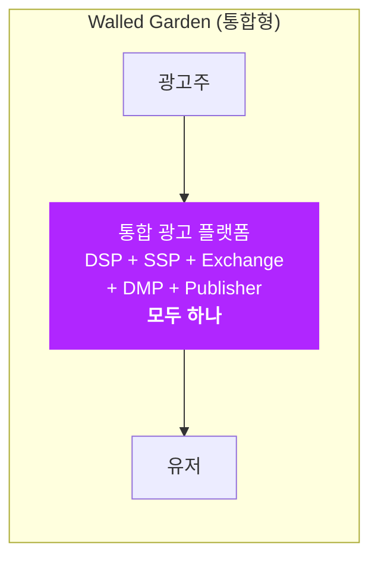
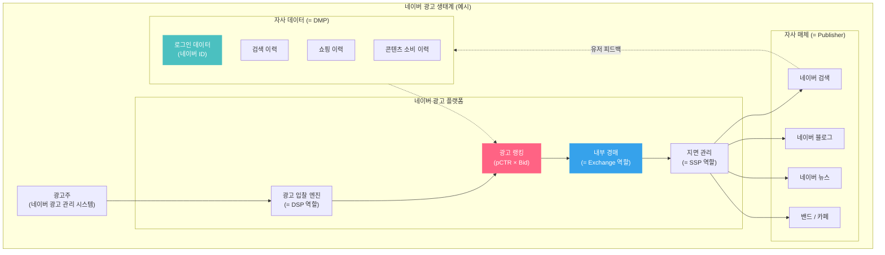
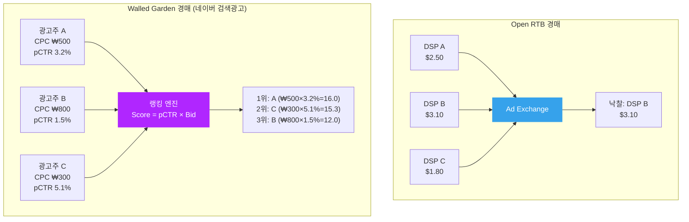
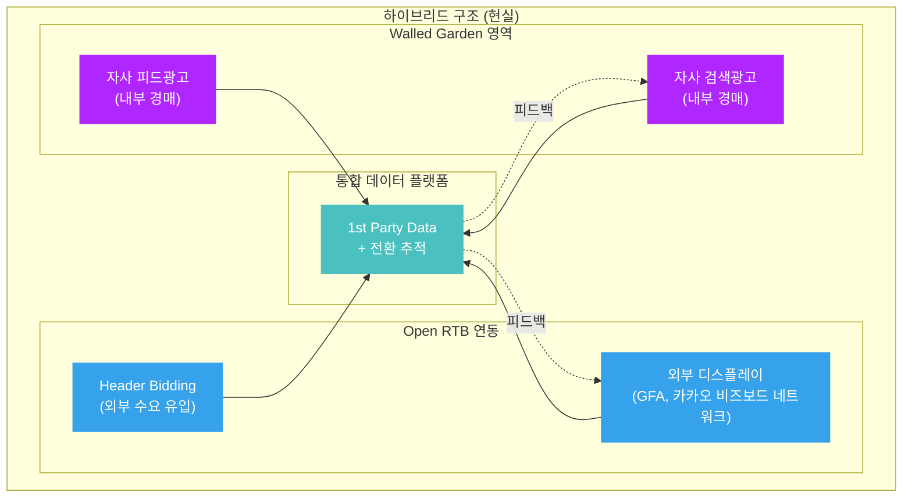

네이버 검색광고, 카카오 비즈보드, 쿠팡 리테일 미디어... 한국 디지털 광고 시장에서 가장 큰 매출을 만드는 플랫폼들은 하나같이 **DSP, SSP, Ad Exchange, Publisher, DMP를 모두 자사 안에** 가지고 있습니다. 이런 구조를 업계에서는 **Walled Garden(폐쇄형 생태계)**이라 부릅니다.

이 글에서는 Open RTB 생태계와 Walled Garden의 구조적 차이를 분석하고, 엔지니어 관점에서 각각이 pCTR 모델링, 입찰 전략, 데이터 활용에 어떤 영향을 미치는지 해부합니다.

---

## 1. Open RTB vs Walled Garden: 구조 비교

### Open RTB 생태계 (분산형)

기존 글([Ad Serving Flow](post.html?id=ad-serving-flow), [광고 기술 생태계 전체 지도](post.html?id=adtech-ecosystem-map))에서 다룬 구조입니다. 각 역할이 **독립 사업자**로 분리되어 있습니다.

### Walled Garden 생태계 (통합형)

네이버, 카카오, 구글, 메타 등은 이 모든 역할을 **하나의 회사**가 수행합니다.

---

## 2. 핵심 차이점 상세 분석

### ① 데이터 통합: 가장 큰 구조적 우위

| 구분 | Open RTB | Walled Garden |
|------|----------|---------------|
| 유저 식별 | 3rd Party Cookie (소멸 중) | **1st Party 로그인 ID** |
| 데이터 범위 | DSP가 보는 데이터 ≠ Publisher 데이터 | **검색 + 클릭 + 구매 + 콘텐츠 소비 = 통합** |
| Cross-device | 확률적 매칭 (부정확) | **로그인 기반 확정 매칭** |
| 전환 추적 | Pixel/Postback (지연, 누락) | **자사 결제 데이터 직접 연동 가능** |

Open RTB에서 DSP는 Bid Request에 담긴 제한된 정보(유저 ID, 지면, 디바이스)만 볼 수 있습니다. 하지만 네이버 광고 플랫폼은 **같은 유저의 검색 쿼리, 쇼핑 행동, 콘텐츠 소비 패턴, 결제 내역**까지 하나의 파이프라인에서 접근할 수 있습니다.

이것이 pCTR 모델에 주는 의미:
- **Feature 풍부도**: Open RTB의 DSP가 사용하는 피처가 수십 개라면, Walled Garden은 수백~수천 개의 1st party 피처를 활용 가능
- **라벨 정확도**: 전환 추적이 자사 시스템 안에서 완결되므로 Delayed Feedback, Attribution 문제가 크게 완화됨
- **Privacy 내성**: 3rd Party Cookie 폐지의 영향을 거의 받지 않음

### ② 경매 구조: 내부 경매의 특수성

Open RTB에서는 여러 DSP가 Exchange를 통해 경쟁합니다. Walled Garden에서는 **같은 플랫폼 내의 광고주끼리만** 경쟁합니다.

**Walled Garden 경매의 특징:**

- **Bid Shading 불필요**: 대부분 GSP(Generalized Second-Price) 또는 VCG 방식을 사용. 네이버 검색광고는 바로 아래 순위의 광고주가 지불할 최소 금액 + 1원을 과금하는 구조
- **pCTR의 역할 변화**: Open RTB에서 pCTR은 True Value 계산의 입력이지만, Walled Garden에서는 **랭킹 점수 자체의 핵심 요소**. pCTR이 높으면 낮은 CPC로도 상위 노출 가능
- **경쟁 범위 제한**: 같은 키워드/타겟팅을 설정한 광고주끼리만 경쟁. Open RTB처럼 수백 개 DSP가 동시 입찰하는 상황이 아님

### ③ 정보 비대칭의 해소

Open RTB에서 DSP 엔지니어가 겪는 핵심 난관들이 Walled Garden에서는 구조적으로 해소됩니다:

| Open RTB의 난관 | 원인 | Walled Garden에서의 해결 |
|----------------|------|------------------------|
| **Censored Data** | 패찰 시 시장가 미관측 | 내부 경매이므로 **모든 입찰가 관측 가능** |
| **Selection Bias** | 낙찰한 광고만 피드백 수집 | 노출 순위별 클릭 데이터 수집 → **Position Bias 보정**으로 전환 |
| **Delayed Feedback** | 3rd party 전환 추적 지연 | 자사 결제 시스템과 직접 연동 → **실시간 전환 확인** |
| **Cross-device 추적** | Cookie 기반 확률 매칭 | 로그인 ID 기반 → **100% 확정 매칭** |
| **Feature 제한** | Bid Request의 제한된 정보 | **검색 쿼리 + 행동 이력 + 구매 데이터 통합** |

---

## 3. Walled Garden 내부의 pCTR 모델링 차이

### ① 피처 설계: 검색 의도가 핵심

Open RTB의 디스플레이 광고에서는 유저 프로필(나이, 성별, 관심사)과 지면 정보가 주요 피처입니다. 반면 네이버/카카오 같은 검색 광고 기반 Walled Garden에서는 **검색 쿼리의 의도(intent)**가 가장 강력한 피처입니다.

| 피처 카테고리 | Open RTB (디스플레이) | Walled Garden (검색 광고) |
|-------------|---------------------|-------------------------|
| **최강 피처** | 유저 세그먼트, 지면 도메인 | **검색 쿼리** (구매 의도 직접 반영) |
| 유저 피처 | 3rd party 세그먼트 (부정확) | 1st party 행동 이력 (정확) |
| 컨텍스트 | 지면 URL, 광고 사이즈 | 검색 결과 페이지 위치, 시간대 |
| 광고 피처 | Creative 사이즈, 포맷 | 키워드 매칭 타입, 광고 품질 점수 |
| 이력 피처 | 제한적 (Cookie 기반) | **최근 검색/클릭/구매 시퀀스** |

### ② 모델 아키텍처: Position Bias 보정

Walled Garden의 검색 광고에서는 **노출 위치(Position)**가 CTR에 막대한 영향을 미칩니다. 1위 광고는 위치 자체의 이점으로 높은 CTR을 받고, 5위 광고는 같은 품질이라도 낮은 CTR을 보입니다.

이를 분리하기 위해 Walled Garden의 pCTR 모델은 보통 다음과 같이 설계됩니다:

$$pCTR(ad, user, query, position) = \underbrace{P(\text{examine} | position)}_{\text{Position Bias}} \times \underbrace{P(\text{click} | \text{examine}, ad, user, query)}_{\text{진짜 광고 품질}}$$

- **Examination Probability**: 유저가 해당 위치까지 시선을 보낼 확률 (위치에만 의존)
- **Click Probability given Examination**: 광고를 실제로 봤을 때 클릭할 확률 (광고 품질)

이 분리가 중요한 이유: 랭킹 시에는 Position Bias를 제거한 **순수 광고 품질 점수**로 순위를 매겨야 합니다. 위치 효과를 제거하지 않으면, "1위라서 클릭이 많았고, 클릭이 많으니까 1위를 유지하는" 강화 루프(rich-get-richer)가 발생합니다.

### ③ 학습 데이터: 오프라인 평가의 어려움

역설적으로, Walled Garden은 Open RTB보다 **오프라인 모델 평가가 더 어렵습니다**.

Open RTB에서는 입찰 여부와 무관하게 모든 Bid Request에 대해 pCTR을 계산하므로, 모델의 예측 vs 실제 클릭을 비교하기가 상대적으로 쉽습니다.

Walled Garden에서는 **모델이 노출할 광고를 결정**하므로, 노출되지 않은 광고의 잠재 CTR을 알 수 없습니다. 이를 **Counterfactual Evaluation** 문제라 하며, 해결을 위해:

- **IPS (Inverse Propensity Scoring)**: 노출 확률의 역수로 가중치를 부여하여 편향 보정
- **Randomized Exploration**: 트래픽의 일부(보통 1~5%)를 랜덤 노출에 할당하여 탐색 데이터 수집
- **Replay Method**: 과거 로그에서 현재 모델의 선택과 일치하는 샘플만 추출하여 평가

---

## 4. 주요 플랫폼별 비교

### 한국 시장

| 플랫폼 | 핵심 매체 | 주요 광고 상품 | 과금 모델 | 특징 |
|--------|---------|-------------|---------|------|
| **네이버** | 검색, 블로그, 뉴스, 쇼핑 | 파워링크, 쇼핑검색광고, 성과형 디스플레이 | CPC, CPM | 검색 쿼리 + 쇼핑 데이터 통합 |
| **카카오** | 카카오톡, 다음, 카카오맵 | 비즈보드, 키워드광고, 카카오모먼트 | CPC, CPM, CPA | 메신저 기반 소셜 데이터 |
| **쿠팡** | 쿠팡 앱/웹 | 쿠팡 애즈 (Retail Media) | CPC | **구매 데이터 직접 보유** → ROAS 최적화에 가장 유리 |

### 글로벌 Walled Garden

| 플랫폼 | 핵심 데이터 | 광고 수익 (2024) | 특징 |
|--------|-----------|----------------|------|
| **Google** | 검색 쿼리 + YouTube 시청 + Gmail + Android | ~$265B | 검색 + 디스플레이 + 비디오 통합 |
| **Meta** | 소셜 그래프 + Instagram + WhatsApp | ~$160B | 소셜 시그널 기반 관심사 타겟팅 |
| **Amazon** | 구매 이력 + 검색 + 리뷰 | ~$56B | 구매 의도 데이터 = 가장 직접적 전환 신호 |
| **Apple** | App Store + Apple ID + 디바이스 센서 | ~$10B | ATT로 경쟁사 데이터 제한 + 자사 광고 확대 |

---

## 5. Walled Garden의 한계와 트레이드오프

Walled Garden이 모든 면에서 우월한 것은 아닙니다:

### ① 수요 경쟁의 부재

Open RTB에서는 수백 개 DSP가 동시 입찰하여 매체 수익을 극대화합니다. Walled Garden은 자사 광고주만 참여하므로, **매체 관점에서 경쟁 입찰가가 낮을 수 있습니다**. 이것이 네이버가 외부 광고 네트워크(GFA 등)를 별도로 운영하는 이유 중 하나입니다.

### ② 광고주 Lock-in

광고주 입장에서 Walled Garden은 **데이터 이동이 불가능**합니다. 네이버에서 쌓은 캠페인 데이터와 최적화 결과를 카카오로 가져갈 수 없습니다. 이로 인해:
- 플랫폼 간 성과 비교가 어려움 (각자 다른 기준으로 리포팅)
- **Attribution 전쟁**: 각 플랫폼이 자사에 유리하게 전환을 집계하려는 동기

### ③ 투명성 문제

Open RTB에서는 DSP가 Bid Request/Response를 직접 제어하고 경매 결과를 검증할 수 있습니다. Walled Garden에서는 플랫폼이 **경매 알고리즘, 품질 점수, 과금 로직**을 모두 통제하며 외부에 공개하지 않습니다.

광고주는 "왜 내 광고가 3위인지", "품질 점수가 어떻게 계산되는지"를 정확히 알 수 없습니다. 이 블랙박스 구조는 플랫폼에 대한 신뢰 문제로 이어질 수 있습니다.

---

## 6. 하이브리드 모델: 현실의 진화 방향

실제로는 순수한 Open RTB나 순수한 Walled Garden보다, **하이브리드 구조**가 주류입니다:

- **네이버**: 파워링크(Walled Garden) + GFA 성과형 디스플레이(외부 매체 네트워크)
- **카카오**: 비즈보드(Walled Garden) + 카카오 모먼트 네트워크(외부 매체 포함)
- **구글**: Google Ads 검색(Walled Garden) + Google Display Network + AdX(Open RTB Exchange)

이 구조에서 플랫폼은 **자사 매체의 프리미엄 인벤토리는 내부 경매로 수익을 극대화**하고, **외부 매체 네트워크는 Open RTB로 규모를 확장**하는 전략을 취합니다.

---

## 7. Walled Garden의 Bid Shading: 정보를 다 가진 플랫폼이 입찰가를 깎는 이유

앞서 Walled Garden은 시장 가격 정보를 내부적으로 보유하므로 [Bid Shading](post.html?id=bid-shading-censored)이 필요 없다고 설명했습니다. 그런데 카카오 모먼트의 "스마트 입찰", 네이버의 "자동 입찰" 같은 기능은 본질적으로 **플랫폼이 광고주 대신 입찰가를 깎아주는 Bid Shading**입니다. 왜 정보를 다 가진 플랫폼이 Bid Shading을 도입했을까요?

### 이유 1: Unified Auction -- 외부 DSP와의 공정한 경쟁

섹션 6에서 설명한 하이브리드 모델의 직접적인 결과입니다. 카카오톡 비즈보드처럼 외부 DSP(Moloco, The Trade Desk 등)가 같은 지면을 놓고 경쟁하는 상황을 생각해 봅시다.

| 참가자 | 경매 방식 | 입찰가 | 실제 지불 | 플랫폼 수익 |
|--------|----------|--------|----------|------------|
| 내부 광고주 (기존) | 2nd Price | 300원 | 201원 (2등+1) | 201원 |
| 외부 DSP (Moloco) | 1st Price | 200원 | 200원 | 200원 |

같은 1등인데 지불 규칙이 다르면 형평성 문제가 생깁니다. 내부 광고주는 300원을 써도 201원만 내고, 외부 DSP는 200원을 그대로 냅니다. 플랫폼 입장에서도 수익 예측이 어려워집니다.

해결책은 **모두 1st Price로 통일**하는 것입니다. 하지만 1st Price로 전환하면 내부 광고주가 300원을 그대로 지불하게 됩니다. 이전에는 201원만 냈는데 갑자기 300원을 내라고 하면? 이때 플랫폼이 **"경쟁 상황을 보니 201원이면 이깁니다"**라고 판단하여 자동으로 입찰가를 깎아주는 것이 Unified Auction 환경의 Bid Shading입니다.

### 이유 2: Winner's Curse 방지 -- 광고주 이탈 차단

외부 DSP가 없더라도 1st Price 환경에서는 Bid Shading이 필요합니다.

소상공인(SMB) 광고주가 "무조건 노출하고 싶다"며 10,000원을 입찰했다고 가정합니다. 실제 경쟁 수준은 3,000원 정도인데 1st Price에서 10,000원이 그대로 과금되면:

- 예산이 3배 빠르게 소진됩니다
- 광고 효율(ROAS)이 폭락합니다
- 광고주가 "이 플랫폼은 너무 비싸다"며 이탈합니다

플랫폼은 광고주가 오래 남아서 지속적으로 예산을 집행하길 원합니다. 그래서 **"10,000원 내셨지만, 3,500원이면 1등입니다"**라고 자동으로 깎아주는 것입니다. 이것이 "자동 입찰", "스마트 입찰" 기능의 본질입니다.

### Open RTB의 Bid Shading과의 차이

| 비교 항목 | Open RTB Bid Shading | Walled Garden Bid Shading |
|-----------|---------------------|--------------------------|
| 수행 주체 | DSP (외부) | 플랫폼 (내부) |
| 정보 수준 | 경쟁자 가격 모름 (Censored Data) | 경쟁자 가격을 알고 있음 |
| 핵심 난이도 | 시장 분포 추정 (통계적 추론) | 광고주별 최적 깎기 비율 결정 |
| 목적 | DSP의 마진 확보 | 광고주 보호 + 경매 공정성 |

Open RTB에서 DSP가 하는 Bid Shading은 "안개 속에서 적정 가격을 찾는" 통계적 문제입니다. 반면 Walled Garden의 Bid Shading은 **모든 패를 보면서 광고주에게 최적가를 제시하는** 최적화 문제에 가깝습니다. 기술적 난이도는 다르지만, 둘 다 "1st Price 환경에서 과다 지불을 방지한다"는 목적은 동일합니다.

> [Auto-Bidding 포스트](post.html?id=auto-bidding-pacing)에서 PID Controller, Lagrangian Dual 등 자동 입찰의 구체적인 알고리즘을 다루고 있습니다. Walled Garden의 "스마트 입찰"은 이 알고리즘들의 단순화된 버전으로 이해할 수 있습니다.

---

## 마무리

1. **Walled Garden은 데이터 통합의 힘**으로 Open RTB 대비 정확한 타겟팅과 전환 추적이 가능합니다. 3rd Party Cookie 시대의 종말과 함께 이 우위는 더 강화되고 있습니다.

2. **pCTR 모델링의 관점이 다릅니다** — Open RTB에서는 "제한된 정보로 True Value를 추정"하는 게 핵심이지만, Walled Garden에서는 "풍부한 데이터로 Position Bias를 분리하고 순수 품질을 평가"하는 게 핵심입니다.

3. **경매 구조가 다르지만, Bid Shading은 공통 과제** — Censored Data 문제는 Walled Garden에서는 발생하지 않지만, Unified Auction과 광고주 보호를 위해 Bid Shading 자체는 Walled Garden에서도 필수 기술이 되었습니다. 다만 "모르는 가격을 추정하는 문제"가 아니라 "아는 가격에서 최적 깎기를 결정하는 문제"로 성격이 달라집니다.

4. **현실은 하이브리드** — 순수한 Walled Garden은 없습니다. 모든 주요 플랫폼이 자사 매체(내부 경매)와 외부 네트워크(Open RTB)를 동시에 운영하며, 이 두 세계를 잇는 통합 데이터 플랫폼이 경쟁력의 핵심입니다.

5. **AdTech 엔지니어에게 시사점** — Open RTB 기술(Bid Shading, MAB, Censored Regression)과 Walled Garden 기술(Position Bias 보정, IPS, Counterfactual Evaluation) 모두를 이해해야 현대 광고 시스템의 전체 그림이 그려집니다.
