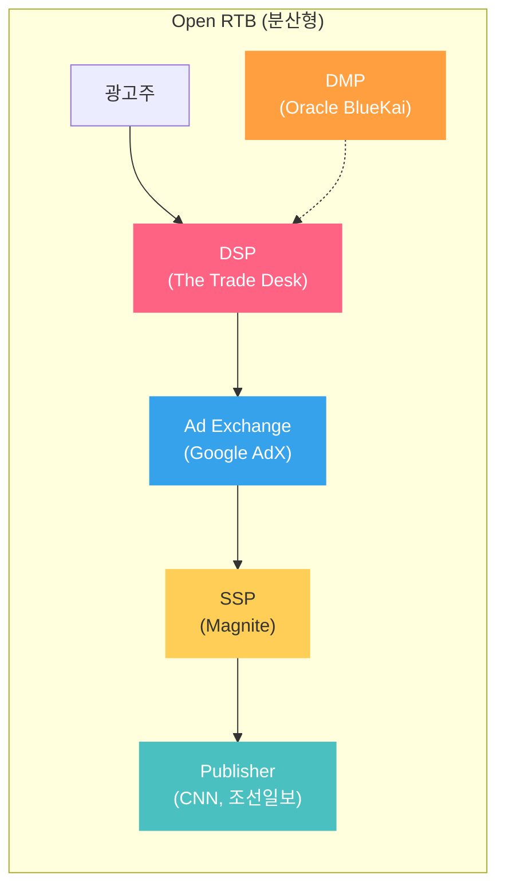
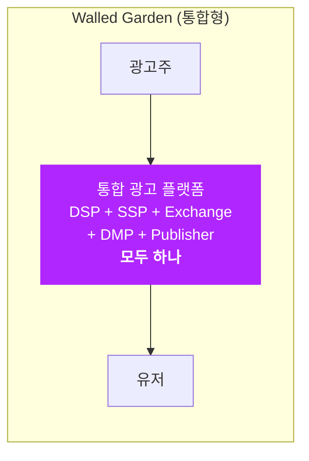
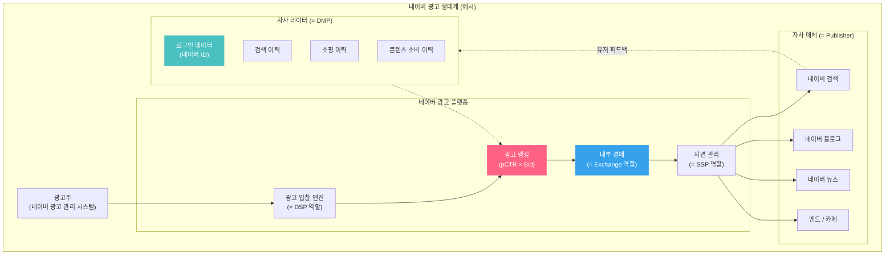
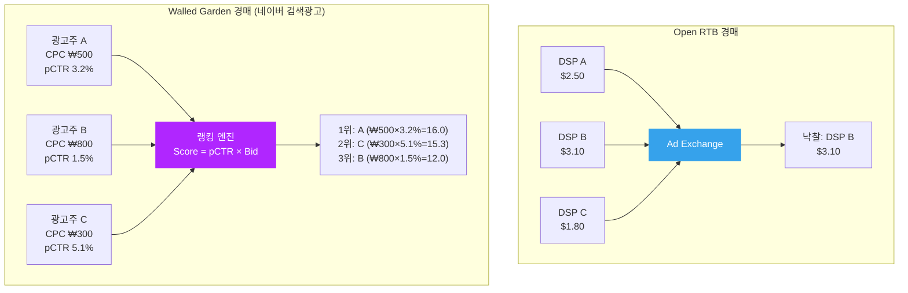
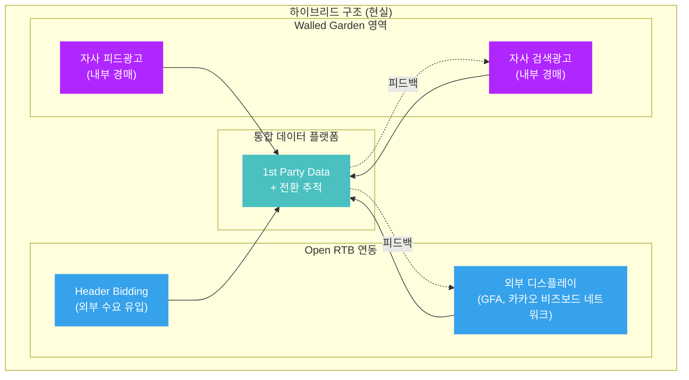

네이버 검색광고, 카카오 비즈보드, 쿠팡 리테일 미디어. 한국 디지털 광고 시장에서 가장 큰 매출을 만드는 플랫폼들입니다. 이 플랫폼들은 하나같이 **DSP, SSP, Ad Exchange, Publisher, DMP를 모두 자사 안에** 가지고 있습니다. 이런 구조를 업계에서는 **Walled Garden(폐쇄형 생태계)**이라 부릅니다.

이 글에서는 Open RTB 생태계와 Walled Garden의 구조적 차이를 분석합니다. 그리고 엔지니어 관점에서 각각이 pCTR 모델링, 입찰 전략, 데이터 활용에 어떤 영향을 미치는지 해부합니다.

---

## 1. Open RTB vs Walled Garden: 구조 비교

**같은 배너 광고 하나가 뜬다. 한쪽은 회사 네 곳의 문턱을 넘고, 한쪽은 한 회사 안에서 끝난다.** 이 구조 차이가 이 글 전체를 관통하는 축이다.

### Open RTB 생태계 (분산형)

[Ad Serving Flow](post.html?id=ad-serving-flow)에서 이미 다룬 구조입니다. [광고 기술 생태계 전체 지도](post.html?id=adtech-ecosystem-map)도 함께 참고할 만합니다. 각 역할이 **독립 사업자**로 분리되어 있습니다.

예를 들어 조선일보 지면에 배너 하나가 뜨려면 여러 회사를 거칩니다. 광고주 → DSP(The Trade Desk) → Ad Exchange(Google AdX)로 이어집니다. 그다음 → SSP(Magnite) → Publisher(조선일보) 순서로 도착합니다. 이 과정에서 **네 번의 회사 경계**를 넘습니다. 경계를 넘을 때마다 계약이 따로 있고, 수수료도 따로 붙습니다. 이 수수료가 실제로 얼마나 쌓이는지는 이미 계산해 봤습니다. [DSP·SSP·Ad Exchange 글](post.html?id=dsp-ssp-exchange)에서 단계별로 확인할 수 있습니다.

이렇게 나뉜 이유는 각자 전문화가 유리하기 때문입니다. DSP는 입찰 알고리즘에, SSP는 지면 확보에, Exchange는 매칭 속도에 집중합니다. 대신 대가도 있습니다. 광고주가 낸 돈의 상당 부분이 중간에서 사라지고, 어느 회사도 전체 그림을 다 보지 못합니다.


```mermaid
graph LR
    subgraph Open["Open RTB (분산형)"]
        ADV1["광고주"] --> DSP1["DSP<br/>(The Trade Desk)"]
        DSP1 --> ADEX1["Ad Exchange<br/>(Google AdX)"]
        ADEX1 --> SSP1["SSP<br/>(Magnite)"]
        SSP1 --> PUB1["Publisher<br/>(CNN, 조선일보)"]
        DMP1["DMP<br/>(Oracle BlueKai)"] -.-> DSP1
    end

    style DSP1 fill:#ff6384,stroke:#ff6384,color:#fff
    style ADEX1 fill:#36a2eb,stroke:#36a2eb,color:#fff
    style SSP1 fill:#ffce56,stroke:#ffce56,color:#333
    style PUB1 fill:#4bc0c0,stroke:#4bc0c0,color:#fff
    style DMP1 fill:#ff9f40,stroke:#ff9f40,color:#fff
```

### Walled Garden 생태계 (통합형)

네이버, 카카오, 구글, 메타 등은 이 모든 역할을 **하나의 회사**가 수행합니다. 비유하면 백화점 하나가 건물 임대부터 매장 운영, 결제, 멤버십 데이터까지 전부 자기 것으로 갖고 있는 모습과 같습니다. 다른 임대인이나 다른 결제 대행사를 거칠 필요가 없습니다.

경계가 없으니 회사 간 계약도, 그 사이에서 새는 수수료도 없습니다. 대신 부서 간 데이터 공유는 계약이 아니라 **내부 API 호출 한 번**으로 끝납니다. pCTR 모델을 만드는 엔지니어 입장에서는 이런 뜻입니다. DSP·SSP·Exchange가 따로 쌓던 로그를, 하나의 파이프라인에서 그대로 이어받습니다. 이 데이터 통합이 실제로 돈으로 어떻게 이어지는지는 §8에서 숫자로 계산해 봅니다.


```mermaid
graph LR
    subgraph Walled["Walled Garden (통합형)"]
        ADV2["광고주"] --> PLATFORM["통합 광고 플랫폼<br/>DSP + SSP + Exchange<br/>+ DMP + Publisher<br/><b>모두 하나</b>"]
        PLATFORM --> USER2["유저"]
    end

    style PLATFORM fill:#b026ff,stroke:#b026ff,color:#fff
```


```mermaid
graph TB
    subgraph Naver["네이버 광고 생태계 (예시)"]
        ADV_N["광고주<br/>(네이버 광고 관리 시스템)"]
        
        subgraph Platform_N["네이버 광고 플랫폼"]
            DSP_N["광고 입찰 엔진<br/>(= DSP 역할)"]
            RANK_N["광고 랭킹<br/>(pCTR × Bid)"]
            AUCTION_N["내부 경매<br/>(= Exchange 역할)"]
            SSP_N["지면 관리<br/>(= SSP 역할)"]
        end
        
        subgraph Media_N["자사 매체 (= Publisher)"]
            SEARCH_N["네이버 검색"]
            BLOG_N["네이버 블로그"]
            NEWS_N["네이버 뉴스"]
            BAND_N["밴드 / 카페"]
        end
        
        subgraph Data_N["자사 데이터 (= DMP)"]
            LOGIN_N["로그인 데이터<br/>(네이버 ID)"]
            SEARCH_LOG["검색 이력"]
            SHOP_LOG["쇼핑 이력"]
            CONTENT_LOG["콘텐츠 소비 이력"]
        end

        ADV_N --> DSP_N
        DSP_N --> RANK_N
        RANK_N --> AUCTION_N
        AUCTION_N --> SSP_N
        SSP_N --> SEARCH_N
        SSP_N --> BLOG_N
        SSP_N --> NEWS_N
        SSP_N --> BAND_N
        
        Data_N -.-> RANK_N
        SEARCH_N -.->|유저 피드백| Data_N
    end

    style RANK_N fill:#ff6384,stroke:#ff6384,color:#fff
    style AUCTION_N fill:#36a2eb,stroke:#36a2eb,color:#fff
    style LOGIN_N fill:#4bc0c0,stroke:#4bc0c0,color:#fff
```

---

## 2. 핵심 차이점 상세 분석

### ① 데이터 통합: 가장 큰 구조적 우위 [무대: 닫힌 생태계]

| 구분 | Open RTB | Walled Garden |
|------|----------|---------------|
| 유저 식별 | 3rd Party Cookie (소멸 중) | **1st Party 로그인 ID** |
| 데이터 범위 | DSP가 보는 데이터 ≠ Publisher 데이터 | **검색 + 클릭 + 구매 + 콘텐츠 소비 = 통합** |
| Cross-device | 확률적 매칭 (부정확) | **로그인 기반 확정 매칭** |
| 전환 추적 | Pixel/Postback (지연, 누락) | **자사 결제 데이터 직접 연동 가능** |

Open RTB에서 DSP는 Bid Request에 담긴 제한된 정보(유저 ID, 지면, 디바이스)만 볼 수 있습니다. 하지만 네이버 광고 플랫폼은 **같은 유저의 검색 쿼리, 쇼핑 행동, 콘텐츠 소비 패턴, 결제 내역**까지 하나의 파이프라인에서 접근할 수 있습니다.

이것이 pCTR 모델에 주는 의미:
- **Feature 풍부도**: Open RTB의 DSP가 사용하는 피처가 수십 개라면, Walled Garden은 수백~수천 개의 1st party 피처를 활용 가능
- **라벨 정확도**: 전환 추적이 자사 시스템 안에서 완결되므로 Delayed Feedback, Attribution 문제가 크게 완화됨
- **Privacy 내성**: 3rd Party Cookie 폐지의 영향을 거의 받지 않음
- **실험 속도**: 홀드아웃(A/B 테스트)을 자사 트래픽에 바로 걸 수 있어, 효과를 실험으로 직접 확인하는 주기가 짧음 ([어트리뷰션 입문](post.html?id=attribution-basics)의 담장 안 측정 참고)

### ② 경매 구조: 내부 경매의 특수성

Open RTB에서는 여러 DSP가 Exchange를 통해 경쟁합니다. Walled Garden에서는 **같은 플랫폼 내의 광고주끼리만** 경쟁합니다.


```mermaid
graph TD
    subgraph OpenAuction["Open RTB 경매"]
        direction LR
        D1["DSP A<br/>$2.50"] --> EX["Ad Exchange"]
        D2["DSP B<br/>$3.10"] --> EX
        D3["DSP C<br/>$1.80"] --> EX
        EX --> W1["낙찰: DSP B<br/>$3.10"]
    end

    subgraph WalledAuction["Walled Garden 경매 (네이버 검색광고)"]
        direction LR
        A1["광고주 A<br/>CPC ₩500<br/>pCTR 3.2%"] --> RANK["랭킹 엔진<br/>Score = pCTR × Bid"]
        A2["광고주 B<br/>CPC ₩800<br/>pCTR 1.5%"] --> RANK
        A3["광고주 C<br/>CPC ₩300<br/>pCTR 5.1%"] --> RANK
        RANK --> W2["1위: A (₩500×3.2%=16.0)<br/>2위: C (₩300×5.1%=15.3)<br/>3위: B (₩800×1.5%=12.0)"]
    end

    style EX fill:#36a2eb,stroke:#36a2eb,color:#fff
    style RANK fill:#b026ff,stroke:#b026ff,color:#fff
```

**Walled Garden 경매의 특징:**

- **Bid Shading 불필요**: 대부분 GSP(Generalized Second-Price) 또는 VCG 방식을 사용. 네이버 검색광고는 바로 아래 순위의 광고주가 지불할 최소 금액 + 1원을 과금하는 구조
- **pCTR의 역할 변화**: Open RTB에서 pCTR은 True Value 계산의 입력이지만, Walled Garden에서는 **랭킹 점수 자체의 핵심 요소**. pCTR이 높으면 낮은 CPC로도 상위 노출 가능
- **경쟁 범위 제한**: 같은 키워드/타겟팅을 설정한 광고주끼리만 경쟁. Open RTB처럼 수백 개 DSP가 동시 입찰하는 상황이 아님

### ③ 정보 비대칭의 해소

Open RTB에서 DSP 엔지니어가 겪는 핵심 난관들은 다음과 같습니다. Walled Garden에서는 이 난관들이 구조적으로 해소됩니다.

| Open RTB의 난관 | 원인 | Walled Garden에서의 해결 |
|----------------|------|------------------------|
| **Censored Data** | 패찰 시 시장가 미관측 | 내부 경매이므로 **모든 입찰가 관측 가능** |
| **Selection Bias** | 낙찰한 광고만 피드백 수집 | 노출 순위별 클릭 데이터 수집 → **Position Bias 보정**으로 전환 |
| **Delayed Feedback** | 3rd party 전환 추적 지연 | 자사 결제 시스템과 직접 연동 → **실시간 전환 확인** |
| **Cross-device 추적** | Cookie 기반 확률 매칭 | 로그인 ID 기반 → **100% 확정 매칭** |
| **Feature 제한** | Bid Request의 제한된 정보 | **검색 쿼리 + 행동 이력 + 구매 데이터 통합** |

---

## 3. Walled Garden 내부의 pCTR 모델링 차이

### ① 피처 설계: 검색 의도가 핵심

Open RTB의 디스플레이 광고에서는 유저 프로필(나이, 성별, 관심사)과 지면 정보가 주요 피처입니다. 반면 네이버/카카오 같은 검색 광고 기반 Walled Garden에서는 **검색 쿼리의 의도(intent)**가 가장 강력한 피처입니다.

| 피처 카테고리 | Open RTB (디스플레이) | Walled Garden (검색 광고) |
|-------------|---------------------|-------------------------|
| **최강 피처** | 유저 세그먼트, 지면 도메인 | **검색 쿼리** (구매 의도 직접 반영) |
| 유저 피처 | 3rd party 세그먼트 (부정확) | 1st party 행동 이력 (정확) |
| 컨텍스트 | 지면 URL, 광고 사이즈 | 검색 결과 페이지 위치, 시간대 |
| 광고 피처 | Creative 사이즈, 포맷 | 키워드 매칭 타입, 광고 품질 점수 |
| 이력 피처 | 제한적 (Cookie 기반) | **최근 검색/클릭/구매 시퀀스** |

### ② 모델 아키텍처: Position Bias 보정

Walled Garden의 검색 광고에서는 **노출 위치(Position)**가 CTR에 막대한 영향을 미칩니다. 1위 광고는 위치 자체의 이점으로 높은 CTR을 받고, 5위 광고는 같은 품질이라도 낮은 CTR을 보입니다.

이를 분리하기 위해 Walled Garden의 pCTR 모델은 보통 다음과 같이 설계됩니다.

$$pCTR(ad, user, query, position) = \underbrace{P(\text{examine} | position)}_{\text{Position Bias}} \times \underbrace{P(\text{click} | \text{examine}, ad, user, query)}_{\text{진짜 광고 품질}}$$

- **Examination Probability**: 유저가 해당 위치까지 시선을 보낼 확률 (위치에만 의존)
- **Click Probability given Examination**: 광고를 실제로 봤을 때 클릭할 확률 (광고 품질)

이 분리가 중요한 이유는 이렇습니다. 랭킹 시에는 Position Bias를 제거한 **순수 광고 품질 점수**로 순위를 매겨야 합니다. 위치 효과를 제거하지 않으면 강화 루프(rich-get-richer)가 생깁니다. "1위라서 클릭이 많았고, 클릭이 많으니까 1위를 유지하는" 악순환입니다.

### ③ 학습 데이터: 오프라인 평가의 어려움

역설적으로, Walled Garden은 Open RTB보다 **오프라인 모델 평가가 더 어렵습니다**.

Open RTB에서는 입찰 여부와 무관하게 모든 Bid Request에 대해 pCTR을 계산합니다. 그래서 모델의 예측 vs 실제 클릭을 비교하기가 상대적으로 쉽습니다.

Walled Garden에서는 **모델이 노출할 광고를 결정**하므로, 노출되지 않은 광고의 잠재 CTR을 알 수 없습니다. 이를 **Counterfactual Evaluation** 문제라고 부릅니다. 해결을 위해 다음 방법을 씁니다.

- **IPS (Inverse Propensity Scoring)**: 노출 확률의 역수로 가중치를 부여하여 편향 보정
- **Randomized Exploration**: 트래픽의 일부(보통 1~5%)를 랜덤 노출에 할당하여 탐색 데이터 수집
- **Replay Method**: 과거 로그에서 현재 모델의 선택과 일치하는 샘플만 추출하여 평가

---

## 4. 주요 플랫폼별 비교

**Walled Garden이라는 이름표는 같아도, 안을 들여다보면 저마다 다른 데이터를 무기로 삼습니다.** 한국 3사와 글로벌 4사를 나란히 놓고 비교해 봅니다.

### 한국 시장

| 플랫폼 | 핵심 매체 | 주요 광고 상품 | 과금 모델 | 특징 |
|--------|---------|-------------|---------|------|
| **네이버** | 검색, 블로그, 뉴스, 쇼핑 | 파워링크, 쇼핑검색광고, 성과형 디스플레이 | CPC, CPM | 검색 쿼리 + 쇼핑 데이터 통합 |
| **카카오** | 카카오톡, 다음, 카카오맵 | 비즈보드, 키워드광고, 카카오모먼트 | CPC, CPM, CPA | 메신저 기반 소셜 데이터 |
| **쿠팡** | 쿠팡 앱/웹 | 쿠팡 애즈 (Retail Media) | CPC | **구매 데이터 직접 보유** → ROAS 최적화에 가장 유리 |

세 회사가 **쥔 데이터의 종류**부터 다릅니다. 네이버는 검색 쿼리, 즉 구매 의도가 가장 직접적으로 드러나는 신호를 가졌습니다. 카카오는 수천만 명이 쓰는 메신저의 소셜 그래프를 가졌습니다. 쿠팡은 검색과 구매가 같은 화면, 같은 세션 안에서 일어납니다.

이 중 **쿠팡이 pCTR·pCVR 모델링에 가장 유리한 위치**에 있다는 평가가 많습니다. 검색부터 클릭, 구매까지 전 과정이 하나의 앱 안에서 끊기지 않기 때문입니다. 네이버·카카오도 통합 데이터를 갖고 있습니다. 다만 구매 데이터의 완전성은 네이버페이·카카오페이 연동 여부에 따라 갈립니다.

### 글로벌 Walled Garden

| 플랫폼 | 핵심 데이터 | 광고 수익 (2024) | 특징 |
|--------|-----------|----------------|------|
| **Google** | 검색 쿼리 + YouTube 시청 + Gmail + Android | ~$265B | 검색 + 디스플레이 + 비디오 통합 |
| **Meta** | 소셜 그래프 + Instagram + WhatsApp | ~$160B | 소셜 시그널 기반 관심사 타겟팅 |
| **Amazon** | 구매 이력 + 검색 + 리뷰 | ~$56B | 구매 의도 데이터 = 가장 직접적 전환 신호 |
| **Apple** | App Store + Apple ID + 디바이스 센서 | ~$10B | ATT로 경쟁사 데이터 제한 + 자사 광고 확대 |

네 회사의 **무기가 뚜렷하게 갈립니다.** Google은 검색 의도, 즉 무엇을 찾는가를 가장 강하게 쥐고 있습니다. Meta는 관계망, 즉 누구와 연결되어 있는가를 쥐고 있습니다. Amazon은 구매 이력, 즉 무엇을 실제로 사는가를 쥐고 있습니다.

흥미로운 쪽은 Amazon입니다. 검색 광고의 강자 Google보다 매출 규모는 작습니다. 하지만 **구매 직전 데이터**라는 면에서는 오히려 더 유리하다는 평가를 받습니다. 지갑을 여는 순간과 가장 가까운 신호이기 때문입니다.

Apple의 ~$10B은 공식 공시 항목이 아니라 업계 추정치입니다. Apple은 광고 매출을 별도로 공개하지 않습니다. 다만 ATT 이후 **경쟁사의 데이터는 제한하면서 자사 광고 사업은 키우는** 행보가 뚜렷합니다. 이 배경은 §8의 심화 박스에서 더 다룹니다.

---

## 5. Walled Garden의 한계와 트레이드오프

Walled Garden이 모든 면에서 우월한 것은 아닙니다.

### ① 수요 경쟁의 부재

Open RTB에서는 수백 개 DSP가 동시 입찰하여 매체 수익을 극대화합니다. Walled Garden은 자사 광고주만 참여하므로, **매체 관점에서 경쟁 입찰가가 낮을 수 있습니다**. 이것이 네이버가 외부 광고 네트워크(GFA 등)를 별도로 운영하는 이유 중 하나입니다.

### ② 광고주 Lock-in

광고주 입장에서 Walled Garden은 **데이터 이동이 불가능**합니다. 네이버에서 쌓은 캠페인 데이터와 최적화 결과를 카카오로 가져갈 수 없습니다. 이로 인해:
- 플랫폼 간 성과 비교가 어려움 (각자 다른 기준으로 리포팅)
- **Attribution 전쟁**: 각 플랫폼이 자사에 유리하게 전환을 집계하려는 동기

### ③ 투명성 문제

Open RTB에서는 DSP가 Bid Request/Response를 직접 제어하고 경매 결과를 검증할 수 있습니다. Walled Garden에서는 플랫폼이 **경매 알고리즘, 품질 점수, 과금 로직**을 모두 통제하며 외부에 공개하지 않습니다.

광고주는 "왜 내 광고가 3위인지", "품질 점수가 어떻게 계산되는지"를 정확히 알 수 없습니다. 이 블랙박스 구조는 플랫폼에 대한 신뢰 문제로 이어질 수 있습니다.

### ④ 지면 선택의 폭, 그리고 담장의 잠식 [무대: 열린 RTB]

열린 RTB의 근본적인 강점은 **선택의 폭**입니다. DSP 하나만 붙이면 수만 개 매체의 지면에 접근할 수 있습니다. Walled Garden 광고주는 그 회사의 자사 매체 안에서만 광고를 집행할 수 있습니다.

그런데 담장 안 플랫폼들은 이 폭 안에도 손을 뻗고 있습니다. Google은 검색 담장을 갖고 있습니다. 동시에 Google Display Network와 AdX로 열린 RTB 시장에서도 거래합니다. Amazon DSP는 아마존 바깥 지면까지 매수합니다. 네이버 GFA도 자사 매체 밖 네트워크 지면을 함께 팝니다.

이때 담장 안 플랫폼은 **자기 데이터의 우위를 그대로 들고 열린 시장에 나옵니다.** 독립 DSP는 쿠키·확률적 매칭에 기대 pCTR을 추정합니다. 반면 Google·Amazon은 로그인 기반 1st-party 신호로 같은 유저의 pCTR을 더 정확히 추정합니다. 그 상태로 같은 경매에 참여합니다.

결과적으로 열린 RTB 경매조차, 데이터가 가장 많은 담장 안 플랫폼이 유리해지는 경우가 늘고 있습니다. 개방된 시장의 형식은 그대로인데, 그 안의 경쟁력은 점점 더 담장 안에 쏠리는 셈입니다.

---

## 6. 하이브리드 모델: 현실의 진화 방향

실제로는 순수한 Open RTB나 순수한 Walled Garden보다 **하이브리드 구조**가 주류입니다.


```mermaid
graph TB
    subgraph Hybrid["하이브리드 구조 (현실)"]
        subgraph WG["Walled Garden 영역"]
            SEARCH["자사 검색광고<br/>(내부 경매)"]
            SOCIAL["자사 피드광고<br/>(내부 경매)"]
        end

        subgraph OPEN["Open RTB 연동"]
            GFA["외부 디스플레이<br/>(GFA, 카카오 비즈보드 네트워크)"]
            HB["Header Bidding<br/>(외부 수요 유입)"]
        end

        subgraph Unified["통합 데이터 플랫폼"]
            DATA["1st Party Data<br/>+ 전환 추적"]
        end

        SEARCH --> DATA
        SOCIAL --> DATA
        GFA --> DATA
        HB --> DATA
        DATA -.->|피드백| SEARCH
        DATA -.->|피드백| GFA
    end

    style SEARCH fill:#b026ff,stroke:#b026ff,color:#fff
    style SOCIAL fill:#b026ff,stroke:#b026ff,color:#fff
    style GFA fill:#36a2eb,stroke:#36a2eb,color:#fff
    style HB fill:#36a2eb,stroke:#36a2eb,color:#fff
    style DATA fill:#4bc0c0,stroke:#4bc0c0,color:#fff
```

- **네이버**: 파워링크(Walled Garden) + GFA 성과형 디스플레이(외부 매체 네트워크)
- **카카오**: 비즈보드(Walled Garden) + 카카오 모먼트 네트워크(외부 매체 포함)
- **구글**: Google Ads 검색(Walled Garden) + Google Display Network + AdX(Open RTB Exchange)

이 구조에서 플랫폼은 **자사 매체의 프리미엄 인벤토리**는 내부 경매로 수익을 극대화합니다. 동시에 **외부 매체 네트워크**는 Open RTB로 규모를 확장합니다.

---

## 7. Walled Garden의 Bid Shading: 정보를 다 가진 플랫폼이 입찰가를 깎는 이유

앞서 Walled Garden은 시장 가격 정보를 내부적으로 보유한다고 설명했습니다. 그래서 [Bid Shading](post.html?id=bid-shading-censored)이 필요 없습니다. 그런데 카카오 모먼트의 "스마트 입찰", 네이버의 "자동 입찰" 같은 기능이 있습니다. 이 기능은 본질적으로 **플랫폼이 광고주 대신 입찰가를 깎아주는 Bid Shading**입니다. 왜 정보를 다 가진 플랫폼이 Bid Shading을 도입했을까요?

### 이유 1: Unified Auction -- 외부 DSP와의 공정한 경쟁

섹션 6에서 설명한 하이브리드 모델의 직접적인 결과입니다. 카카오톡 비즈보드처럼 외부 DSP(Moloco, The Trade Desk 등)가 같은 지면을 놓고 경쟁하는 상황을 생각해 봅시다.

| 참가자 | 경매 방식 | 입찰가 | 실제 지불 | 플랫폼 수익 |
|--------|----------|--------|----------|------------|
| 내부 광고주 (기존) | 2nd Price | 300원 | 201원 (2등+1) | 201원 |
| 외부 DSP (Moloco) | 1st Price | 200원 | 200원 | 200원 |

같은 1등인데 지불 규칙이 다르면 형평성 문제가 생깁니다. 내부 광고주는 300원을 써도 201원만 내고, 외부 DSP는 200원을 그대로 냅니다. 플랫폼 입장에서도 수익 예측이 어려워집니다.

해결책은 **모두 1st Price로 통일**하는 것입니다. 하지만 1st Price로 전환하면 내부 광고주가 300원을 그대로 지불하게 됩니다. 이전에는 201원만 냈는데 갑자기 300원을 내라고 하면? 이때 플랫폼은 **"경쟁 상황을 보니 201원이면 이깁니다"**라고 판단해 자동으로 입찰가를 깎아줍니다. 이것이 Unified Auction 환경의 Bid Shading입니다.

### 이유 2: Winner's Curse 방지 -- 광고주 이탈 차단

외부 DSP가 없더라도 1st Price 환경에서는 Bid Shading이 필요합니다.

소상공인(SMB) 광고주가 "무조건 노출하고 싶다"며 10,000원을 입찰했다고 가정합니다. 실제 경쟁 수준은 3,000원 정도인데 1st Price에서 10,000원이 그대로 과금되면 문제가 생깁니다.

- 예산이 3배 빠르게 소진됩니다
- 광고 효율(ROAS)이 폭락합니다
- 광고주가 "이 플랫폼은 너무 비싸다"며 이탈합니다

플랫폼은 광고주가 오래 남아서 지속적으로 예산을 집행하길 원합니다. 그래서 **"10,000원 내셨지만, 3,500원이면 1등입니다"**라고 자동으로 깎아주는 것입니다. 이것이 "자동 입찰", "스마트 입찰" 기능의 본질입니다.

### Open RTB의 Bid Shading과의 차이

| 비교 항목 | Open RTB Bid Shading | Walled Garden Bid Shading |
|-----------|---------------------|--------------------------|
| 수행 주체 | DSP (외부) | 플랫폼 (내부) |
| 정보 수준 | 경쟁자 가격 모름 (Censored Data) | 경쟁자 가격을 알고 있음 |
| 핵심 난이도 | 시장 분포 추정 (통계적 추론) | 광고주별 최적 깎기 비율 결정 |
| 목적 | DSP의 마진 확보 | 광고주 보호 + 경매 공정성 |

Open RTB에서 DSP가 하는 Bid Shading은 "안개 속에서 적정 가격을 찾는" 통계적 문제입니다. 반면 Walled Garden의 Bid Shading은 **모든 패를 보면서 광고주에게 최적가를 제시하는** 최적화 문제에 가깝습니다. 기술적 난이도는 다르지만, 둘 다 "1st Price 환경에서 과다 지불을 방지한다"는 목적은 동일합니다.

> 자동 입찰 알고리즘은 [Auto-Bidding 포스트](post.html?id=auto-bidding-pacing)에서 다룹니다. PID Controller, Lagrangian Dual 등이 그 예입니다. Walled Garden의 "스마트 입찰"은 이 알고리즘들의 단순화된 버전으로 이해할 수 있습니다.

---

## 8. 같은 광고비, 다른 실수령액: 담장 안이 돈이 되는 구조

**같은 광고비 ₩10,000,000이 들어와도, 열린 RTB와 담장 안에서 남는 돈이 다릅니다.** 중간에 몇 회사를 거치는지, 그리고 그 돈이 얼마나 정확한 곳에 쓰이는지가 갈립니다.

월 예산 ₩10,000,000을 쓰는 광고주가 있다고 하겠습니다. 열린 RTB에서는 이 돈이 DSP → Ad Exchange → SSP를 거쳐야 매체에 도착합니다. 담장 안에서는 광고주가 곧바로 플랫폼 한 곳에만 돈을 냅니다.

| 단계 | 열린 RTB 잔액 | 담장 안 잔액 |
|---|---|---|
| 광고주 월 예산 | ₩10,000,000 | ₩10,000,000 |
| DSP 수수료 -15% | ₩8,500,000 | 해당 없음(회사가 하나) |
| Ad Exchange 수수료 -10% | ₩7,650,000 | 해당 없음 |
| SSP 수수료 -15% | ₩6,502,500 | 해당 없음 |
| 내부 운영비 -3% | 해당 없음 | ₩9,700,000 |
| **최종 실수령** | **₩6,502,500 (65.0%)** | **₩9,700,000 (97.0%)** |

가상의 요율(DSP 15%, Exchange 10%, SSP 15%)을 적용해 봅니다. 열린 RTB의 매체는 ₩6,502,500(65.0%)만 받습니다. 담장 안 플랫폼은 내부 운영비 3%만 빼고 ₩9,700,000(97.0%)을 그대로 갖습니다. 회사 세 곳을 거치지 않는 것만으로 **1.49배** 차이가 납니다.

그런데 격차는 여기서 끝나지 않습니다. 담장 안 플랫폼은 같은 유저에 대해 훨씬 많은 1st-party 데이터를 갖고 있습니다. §2에서 본 것처럼, 이 데이터는 pCTR 예측을 더 정확하게 만듭니다. 예측이 정확할수록 광고와 유저를 더 잘 맞춥니다. 같은 예산이라도 실제 클릭·전환이 더 많이 나온다는 뜻입니다.

다음 코드로 두 효과 — 수수료 구조와 예측 정확도 — 를 각각 계산하고, 마지막에 곱해 봅니다. 모든 수치는 가상값입니다.

```python
# 담장 안(Walled Garden)과 열린 RTB, 같은 광고 예산이 최종적으로 어떻게 다르게 쓰이는지 계산한다.
# 두 가지 효과를 따로 구하고, 마지막에 곱한다.
#   효과 1: 중개 수수료 구조 (경유하는 회사 수만큼 수수료가 곱으로 쌓인다)
#   효과 2: 데이터 우위가 만드는 pCTR 예측 정확도 차이 (예측이 정확할수록 더 좋은 광고를 고른다)
# 모든 요율·숫자는 예시를 위한 가상값이다. 표준 라이브러리만 쓴다.
import random

random.seed(7)

BUDGET = 10_000_000  # 광고주가 한 달에 쓰는 예산(원) — 가상값

# --- 효과 1: 중개 수수료 구조 ---
# 열린 RTB: 광고주 지출 -> DSP -> Ad Exchange -> SSP -> 매체. 각 단계가 수수료를 뗀다.
OPEN_RTB_FEES = [0.15, 0.10, 0.15]  # DSP, Ad Exchange, SSP 수수료율(가상)
# 담장 안: 회사가 하나뿐이라 '수수료'가 아니라 내부 운영비만 나간다(가상).
WALLED_GARDEN_COST = 0.03

def take_home(budget, rates):
    remaining = budget
    for rate in rates:
        remaining *= (1 - rate)
    return remaining

open_rtb_revenue = take_home(BUDGET, OPEN_RTB_FEES)
walled_garden_revenue = take_home(BUDGET, [WALLED_GARDEN_COST])
structural_ratio = walled_garden_revenue / open_rtb_revenue

# --- 효과 2: 데이터 우위가 만드는 예측 정확도 차이 ---
# 매 경매마다 후보 광고 5개 중 하나를 골라 노출한다고 가정.
# 후보의 '진짜 클릭 확률'은 아무도 모르고, pCTR '예측치'로 순위를 매겨 1등을 고른다.
# 예측치 = 진짜값 x (1 + 노이즈). 담장 안은 1st-party 데이터가 풍부해 노이즈가 더 작다(가상).
N_AUCTIONS = 50_000
N_CANDIDATES = 5
NOISE_OPEN_RTB = 0.40       # 예측 오차의 상대 표준편차 — 데이터가 부족할수록 큼(가상)
NOISE_WALLED_GARDEN = 0.15  # 1st-party 데이터가 풍부해 오차가 작음(가상)

def avg_true_ctr_of_winners(noise_sd):
    total = 0.0
    for _ in range(N_AUCTIONS):
        true_ctrs = [random.uniform(0.01, 0.05) for _ in range(N_CANDIDATES)]
        predicted = [t * (1 + random.gauss(0, noise_sd)) for t in true_ctrs]
        winner = predicted.index(max(predicted))  # 예측 1등을 낙찰시켜 노출
        total += true_ctrs[winner]                # 실제 클릭은 '진짜' CTR을 따른다
    return total / N_AUCTIONS

avg_ctr_open = avg_true_ctr_of_winners(NOISE_OPEN_RTB)
avg_ctr_walled = avg_true_ctr_of_winners(NOISE_WALLED_GARDEN)
prediction_ratio = avg_ctr_walled / avg_ctr_open

# --- 두 효과를 곱해 '같은 예산 1원'의 최종 효율 격차를 본다 ---
combined_ratio = structural_ratio * prediction_ratio

print(f"열린 RTB 매체 실수령      {open_rtb_revenue:>12,.0f}원  ({open_rtb_revenue/BUDGET:.1%})")
print(f"담장 안 플랫폼 실수령     {walled_garden_revenue:>12,.0f}원  ({walled_garden_revenue/BUDGET:.1%})")
print(f"효과1: 구조적 격차        {structural_ratio:.2f}배")
print(f"열린 RTB 평균 진짜 CTR    {avg_ctr_open:.4%}")
print(f"담장 안 평균 진짜 CTR     {avg_ctr_walled:.4%}")
print(f"효과2: 예측 정확도 격차   {prediction_ratio:.2f}배")
print(f"두 효과를 곱한 최종 격차  {combined_ratio:.2f}배")

# 출력:
# 열린 RTB 매체 실수령         6,502,500원  (65.0%)
# 담장 안 플랫폼 실수령        9,700,000원  (97.0%)
# 효과1: 구조적 격차        1.49배
# 열린 RTB 평균 진짜 CTR    3.9513%
# 담장 안 평균 진짜 CTR     4.2076%
# 효과2: 예측 정확도 격차   1.06배
# 두 효과를 곱한 최종 격차  1.59배
```

코드에서 핵심은 `avg_true_ctr_of_winners`입니다. 예측치에 진짜 값과 노이즈를 곱해서 순위를 흔듭니다. 노이즈가 크면(열린 RTB, 0.40) 5개 후보 중 진짜 1등이 아닌 광고가 낙찰되는 일이 잦습니다. 노이즈가 작으면(담장 안, 0.15) 진짜 1등에 가까운 광고가 더 자주 낙찰됩니다.

그 결과 담장 안에서 낙찰된 광고들의 평균 진짜 CTR(4.21%)이 열린 RTB(3.95%)보다 높습니다. 격차 자체는 1.06배로 크지 않아 보입니다. 하지만 이 차이는 노출되는 모든 광고에 반복해서 곱해집니다. §2의 랭킹 공식은 Score = pCTR × Bid였습니다. pCTR이 정확할수록 실현 eCPM도 최적점에 더 가까워집니다.

두 효과를 곱하면 **1.59배**입니다. 수수료 구조만으로 이미 1.49배 유리한데, 데이터 우위가 그 위에 다시 곱해집니다. 이 숫자들은 전부 가상값입니다. 실제 수수료율도, 실제 노이즈 크기도 회사마다 다르고 공개되지 않습니다. 그래도 방향은 분명합니다. **경계가 없어지면 돈이 덜 새고, 데이터가 모이면 그 돈이 더 정확하게 쓰입니다.**

:::deep 더 깊이 — 프라이버시 규제가 오히려 담장을 강하게 만드는 역설

열린 RTB는 서드파티 쿠키, 모바일 광고 식별자(IDFA·GAID) 같은 '남의 신호'로 유저를 추적합니다. 이 신호들이 최근 몇 년 사이 계속 좁아지고 있습니다.

Safari의 ITP, Firefox의 ETP는 오래전부터 서드파티 쿠키를 기본 차단합니다. Chrome도 쿠키 정책을 여러 차례 손질하며 축소 방향으로 움직여 왔습니다. Apple은 2021년 4월 iOS 14.5부터 ATT(App Tracking Transparency)를 도입했습니다. 앱이 다른 앱·웹사이트에서 유저를 추적하려면 사용자 동의를 먼저 받아야 합니다.

동의율은 낮았습니다. 서드파티 데이터에 의존하던 광고 네트워크는 타격을 입었습니다. Meta는 2022년 한 해 ATT의 영향을 매출 기준 약 100억 달러 규모로 추정한 바 있습니다.

여기서 역설이 시작됩니다. **서드파티 신호가 약해질수록, 로그인 기반 1st-party 데이터의 상대적 가치는 오히려 오릅니다.** 열린 RTB의 DSP는 대체할 신호가 마땅히 없습니다. 반면 담장 안 플랫폼은 원래도 3rd-party 신호에 크게 의존하지 않았습니다. 로그인만 되어 있으면 검색·구매·콘텐츠 소비를 이미 자기 데이터로 갖고 있었기 때문입니다.

규제의 원래 취지는 유저 프라이버시 보호였습니다. 그런데 결과적으로 '이미 로그인 데이터를 가진 소수의 대형 플랫폼'에 유리한 쪽으로 작동한다는 지적이 있습니다. EU의 디지털시장법(DMA)이 구글·메타 같은 '게이트키퍼'를 따로 규제하는 이유 중 하나도 여기에 있습니다.

담장 간 경쟁도 같은 원리로 움직입니다. 구글·메타·아마존은 서로에게 '열린' 상대가 아니라, 각자 다른 데이터를 무기로 삼는 별개의 담장입니다. Amazon Ads가 짧은 시간에 큰 것도 같은 이유입니다. 검색·소셜이 아닌 **구매 데이터**라는 자기만의 1st-party 자산으로 새 담장을 세웠습니다.
:::

---

## 마무리

1. **Walled Garden은 데이터 통합의 힘**으로 Open RTB 대비 정확한 타겟팅과 전환 추적이 가능합니다. 3rd Party Cookie 시대의 종말과 함께 이 우위는 더 강화되고 있습니다.

2. **pCTR 모델링의 관점이 다릅니다** — Open RTB에서는 "제한된 정보로 True Value를 추정"하는 게 핵심이지만, Walled Garden에서는 "풍부한 데이터로 Position Bias를 분리하고 순수 품질을 평가"하는 게 핵심입니다.

3. **경매 구조가 다르지만, Bid Shading은 공통 과제** — Censored Data 문제는 Walled Garden에서는 발생하지 않지만, Unified Auction과 광고주 보호를 위해 Bid Shading 자체는 Walled Garden에서도 필수 기술이 되었습니다. 다만 "모르는 가격을 추정하는 문제"가 아니라 "아는 가격에서 최적 깎기를 결정하는 문제"로 성격이 달라집니다.

4. **현실은 하이브리드** — 순수한 Walled Garden은 없습니다. 모든 주요 플랫폼이 자사 매체(내부 경매)와 외부 네트워크(Open RTB)를 동시에 운영하며, 이 두 세계를 잇는 통합 데이터 플랫폼이 경쟁력의 핵심입니다.

5. **AdTech 엔지니어에게 시사점** — Open RTB 기술(Bid Shading, MAB, Censored Regression)과 Walled Garden 기술(Position Bias 보정, IPS, Counterfactual Evaluation) 모두를 이해해야 현대 광고 시스템의 전체 그림이 그려집니다.

6. **담장이 돈이 되는 이유는 구조와 데이터, 둘 다입니다** — 중개 회사가 없어 수수료가 덜 새고(§8 가상 계산에서 1.49배), 데이터가 모여 pCTR 예측이 더 정확해지는 효과까지 곱해지면 격차는 더 벌어집니다(1.59배). 프라이버시 규제로 3rd-party 신호가 약해질수록 이 격차는 오히려 커지는 역설도 함께 기억해야 합니다.

---

## 더 깊이 보기

- 열린 RTB의 3자 구조와 수수료가 실제로 얼마나 쌓이는지 → [DSP·SSP·Ad Exchange](post.html?id=dsp-ssp-exchange)
- 담장 안 실제 광고 상품이 궁금하면 → [카카오 광고 상품 지도](post.html?id=kakao-ads-products)
- 담장 안/열린 RTB에서 측정(어트리뷰션)이 어떻게 갈리는지 → [어트리뷰션 입문](post.html?id=attribution-basics)
- 정직한 입찰이 왜 무너지는지(Bid Shading) → [Bid Shading & Censored Data](post.html?id=bid-shading-censored)
- 자동입찰 알고리즘의 실제 구현 → [Auto-Bidding & Pacing](post.html?id=auto-bidding-pacing)
- 광고 ML 전체 지도에서 이 글의 위치 → [ML 엔지니어 트랙](ml-track.html)
